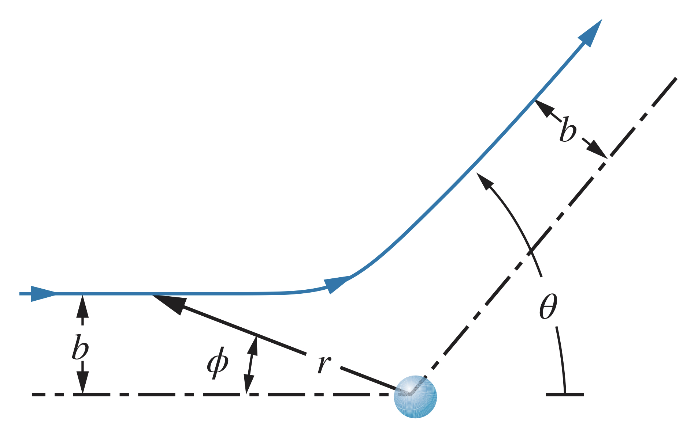
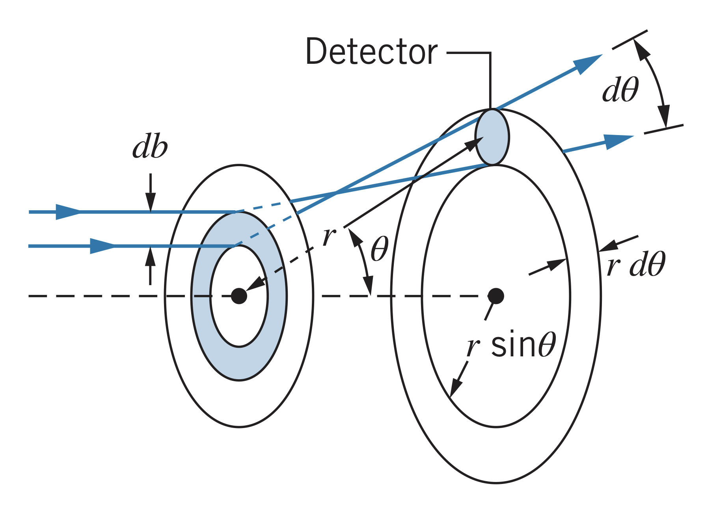
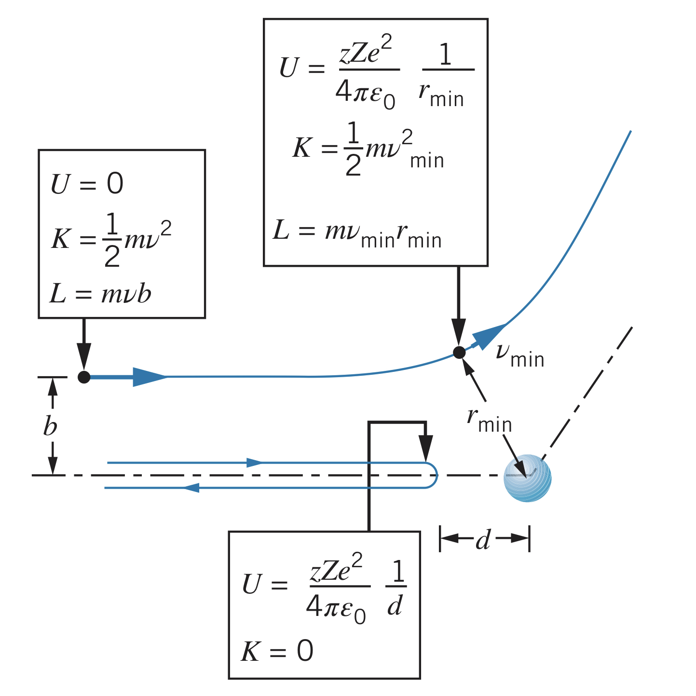

## Rutherford's Observations

While observing the scattering of alpha-particles in atoms, Rutherford realized the equally-distributed positive charge Thomson proposed was unlikely. Instead, Rutherford proposed a small region (called the **nucleus**) or an atom where the positive charge is.

### Repulsive force

For a projectile of charge $ze$, the nucleus hypothesis would predict a repulsive force as such:

$$F=\frac{1}{4\pi\epsilon_0}\frac{\left|q_1\right|\left|q_2\right|}{r^2}=\frac{\left(ze\right)\left(Ze\right)}{4\pi\epsilon_0r^2}$$

!!With the nucleus theory, particles always experience the full positive charge of the atom, unlike in the Thomson model.!!

### Scattering

Particle projectiles follow hyperbolic paths passing by the nucleus of atoms, according to the following equation in polar coordinates:

$$\frac{1}{r}=\frac{1}{b}\sin{\phi}+\frac{zZe^2}{8\pi\epsilon_0b^2K}\left(\cos{\phi}-1\right)$$

Since the particle begins at $\phi=0$ and $r\rightarrow\infty$ and the final position is $\phi=\pi-\theta$ and $r\rightarrow\infty$, the previous equation can be reduced to

$$b=\frac{zZe^2}{8\pi\epsilon_0K}\cot{\frac{1}{2}\theta}=\frac{zZ}{2K}\frac{e^2}{4\pi\epsilon_0}\cot{\frac{1}{2}\theta}$$

The constant term $e^2/4\pi\epsilon_0$ is equal to $1.44$ eV * nm.

The larger the distance $b$, the less the particle will be scattered. The closer the particle comes to the nucleus (smaller $b$), the more it will be scattered.

## Rutherford Scattering

### Some projectiles scatter at angles greater than $\theta$

For a foil of $N$ atoms, one atom thick, the total area is $N\pi R^2$. For the scattering to be greater than $\theta$, the impact parameter must be between $0$ and $b$.

Therefore, the probability of the projectile falling within that range is $\pi b^2/\pi R^2$.

For foils greater than one atom thick, say $t$ thickness with $A$ area, $\rho$ density, and $M$ molar mass, the volume of the foil is $At$, the mass $\rho At$, and number of moles $\rho At/M$. The number of atoms (and therefore nuclei) per unit volume is

$$n=N_A\frac{\rho At}{M}\frac{1}{At}=\frac{N_A\rho}{M}$$

where $N_A$ is Avogadro's number. Using this, the fraction of projectiles scattered at angles of less than $\theta$ is

$$f_{\lt b}=f_{\gt \theta}=nt\pi b^2$$

### Experimental verification

To find the fraction of particles scattered within a small range $\theta$ (between $\theta$ and $\theta + d\theta$), the impact parameter must be between $b$ and $b + db$. The fraction, $df$, is then

$$df=nt\left(2\pi b~db\right)$$

Using the previous equation for $b$, however, $db$ can be calculated to be

$$db=\frac{d}{d\theta}\left(\frac{zZ}{2K}\frac{e^2}{4\pi\epsilon_0}\cot{\frac{1}{2}\theta}\right)=\frac{zZ}{2K}\frac{e^2}{4\pi\epsilon_0}\left(-\csc^2{\frac{1}{2}\theta}\right)\left(\frac{1}{2}~d\theta\right)$$

Therefore,

$$\left|df\right|=\pi nt\left(\frac{zZ}{2K}\right)^2\left(\frac{e^2}{4\pi\epsilon_0}\right)^2\csc^2{\frac{1}{2}\theta}\cot{\frac{1}{2}\theta}~d\theta$$

The *Rutherford scattering formula*, which is the probability per unit area for scattering into the ring, is

$$N\left(\theta\right)\frac{\left|df\right|}{dA}=\frac{nt}{4r^2}\left(\frac{zZ}{2K}\right)^2\left(\frac{e^2}{4\pi\epsilon_0}\right)^2\frac{1}{\sin^4{\frac{1}{2}\theta}}$$

### Closest approach to the nucleus

As a projectile approaches the nucleus, its kinetic energy is transformed into electrostatic potential energy since

$$U=\frac{1}{r\pi\epsilon_0}\frac{q_1q_2}{r}=\frac{1}{4\pi\epsilon_0}\frac{zZe^2}{r}$$

The maximum potential energy occurs when the kinetic energy is lowest (since energy is conserved), which occurs at a distance of $r_{min}$ and velocity of $v_{min}$:

$$E=\frac{1}{2}mv_{min}^2+\frac{1}{4\pi\epsilon_0}\frac{zZe^2}{r_{min}}=\frac{1}{2}mv^2$$

Since angular momentum, $L$, is also conserved, the angular momentum is

$$L=mvb=mv_{min}r_{min}$$

Therefore, $v_{min}=bv/r_{min}$, so

$$\frac{1}{2}mv^2=\frac{1}{2}m\left(\frac{b^2v^2}{r_{min}^2}\right)+\frac{1}{4\pi\epsilon_0}\frac{zZe^2}{r_{min}}$$

Since the kinetic energy is not $0$ at $r_{min}$ unless $b = 0$, the closest approach, $d$, is

$$d=\frac{1}{4\pi\epsilon_0}\frac{zZe^2}{K}$$

The Rutherford scattering law predicts a very small radius for the minimum distance, but it is not always greater than the nuclear radius for large values of $K$ or low values of $Z$. In that case, the particle no longer experiences the full force of the nucleus and so the Rutherford scattering law does not apply.