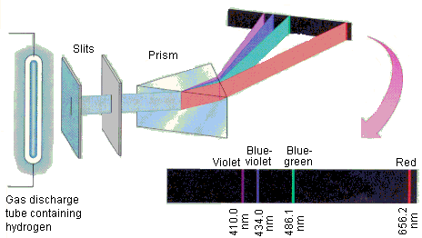

## Types of Radiation

Atoms can either emit electromagnetic radiation in continuous spectra or as discrete wavelengths of light. An example of a continuous spectrum would be thermal radiation by a hot object. On the other hand, atoms such as neon excited in a glass tube emit certain wavelengths of light and do not emit any others.

## Absorption Spectra

When white light (with all wavelengths of light) is passed through a gas, some wavelengths of light will be absorbed, leaving a dark line in the rest of the rainbow spectrum of the light. This is called the sample's **absorption spectrum**, and is not always the same as its emission spectrum.

## Hydrogen's Spectra

Johann Balmer noticed that hyrogen's emission lines follow the following formula quite closely:

$$\lambda=\left(364.5nm\right)\frac{n^2}{n^2-4}$$

Where $n=3,4,5,...$. This is known as the *Balmer formula*, and the series of emission lines that follow it are known as the *Balmer series*.

All of the groupings of lines for hydrogen fit the following formula:

$$\lambda=\lambda_{limit}\frac{n^2}{n^2-n_0^2}$$

Where $n=n_0+1,n_0+2,n_0+3,...$ and $\lambda_{limit}$ is the wavelength of the series limit.

### Ritz combination principle

Converting hydrogen's emission wavelengths to frequencies show that certain pairs of frequencies add to give other frequencies found in the spectrum.

