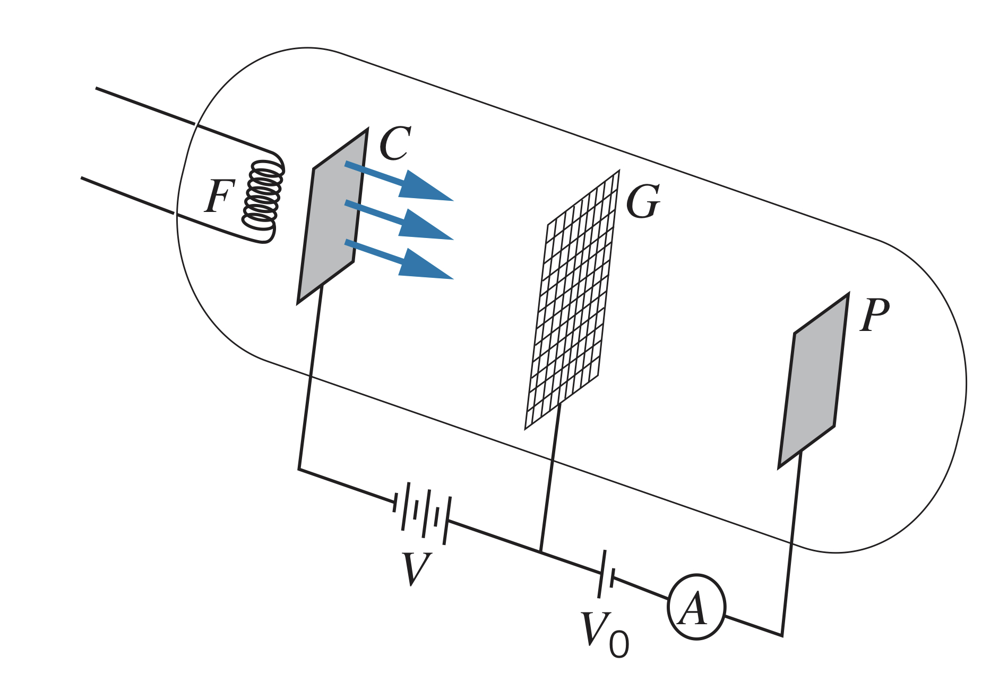

## Experiment Setup

A filament heats a cathode, which emits electrons. Those electrons are accelerated towards a grid, $G$, using a potential difference, $V$. Then, after passing through the grid, the electrons reach a plate if the potential difference, $V$, is greater than the small retarding voltage between the grid and plate, $V_0$. The current reaching the plate is measured using an ammeter, $A$.

## Observations

The tube is filled with hydrogen gas. When the voltage is risen, the current increases due to more electrons having enough energy to overcome the gap between the grid and plate. Some electrons collide with hydrogen atoms, but this is not a problem since the collisions are all perfectly elastic.

However, when the potential $V$ is raised over $10.2V$, some electrons cause the hydrogen atoms to exicte, giving those atoms their energy, therefore not having enough to reach the plate. This is seen as a dip in the current at $10.2V$. The same phenomenon occurs at $20.4V$, when multiple collisions can occur.

## Results

This experiment gave further support to the energy state hypotheses. However, since hydrogen is naturally found as $H_2$, the experiment is typically done with mercury vapor or neon.