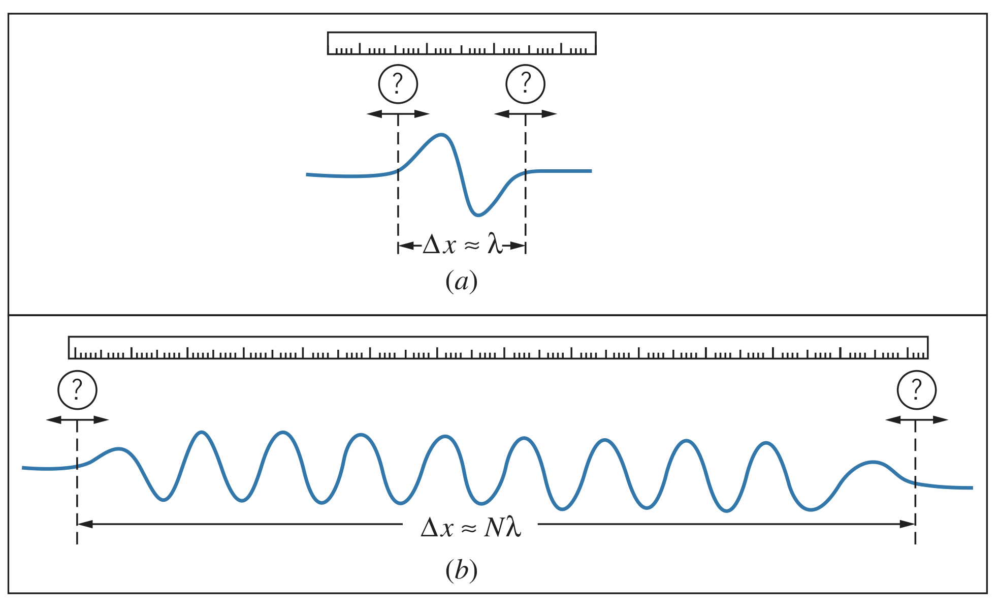

## The Principle of Uncertainty

In quantum mechanics, the amplitude of a de Broglie wave describes its position whereas the wavelength determines its momentum. However, for any wave, it is only ever possible to either locate it or measure its wavelength. This means when studying quantum particles, the better we know about its position, the worse we know about its momentum and vice versa.

## Wave Packets

Real waves can be described as *wave packets*, which are disturbances localized to a region in space. Wave packets occupy a small region of space, $\Delta x$, but it is difficult to determine exactly what the wavelength is because it has no definitive beginning or end. This uncertainty, $\Delta \lambda$, can be represented as a fraction, $\epsilon$, of the wavelength: $\Delta \lambda \sim \epsilon \lambda$. The fraction $\epsilon$ is certainly less than $1$, but is probably greater than $0.01$, so it is approximated as $\epsilon \sim 0.1$ within an order of magnitude.

!!The symbol $\sim$ represents an estimate within about an order of magnitude!!

Since $\Delta x \approx \lambda$, we know

$$\Delta x \Delta \lambda \sim \epsilon \lambda^2$$

Therefore,

$$\Delta x \propto \frac{1}{\Delta \lambda}$$

In words, as $\Delta x$ becomes smaller, $\Delta \lambda$ increases. Even for a longer wave packet, like (b) in the image above, $\Delta x$ becomes $N\lambda$ but $\Delta \lambda$ becomes $\epsilon \lambda / N$, so $\Delta x \Delta \lambda$ is still about $\epsilon \lambda^2$. Therefore, this is a fundamental property of classical waves, and the first of the uncertainty principles for classical waves.

## Frequency-Time Uncertainty Relationship

Imagine that instead of measuring the length of the wave packet, we instead measure the time it takes to pass using timing devices. In that case, the size of the packet is one period of the wave, $T$, so the difference in times on the clock, $\Delta t$, is about $T$. But we encounter the same problem about finding the start and end of the wave cycle, so $\Delta T \sim \epsilon T$. Therefore,

$$\Delta t \Delta T \sim \epsilon T^2$$

This is the second uncertainty principle for classical waves, and shows that for a wave of a given period, the smaller the duration of the wave packet, the larger the uncertainty in our measurement of the period.

Rewriting this in terms of frequency, we know $f=1/T$, but $\Delta f \not ={1/\Delta T}$ since this would imply the uncertainty in period and frequency are inversely proportional. Instead, we take the derivative:

$$df=-\frac{1}{T^2}dT\newline \Delta f = \frac{1}{2}\Delta T$$

(we can ignore the negative since all we care about is the magnitude)

Combining this with the previous equation with $\Delta T$, we get

$$\Delta f \Delta t \sim \epsilon$$

Therefore, the longer the duration of the wave packet, the more precisely the frequency can be measured.