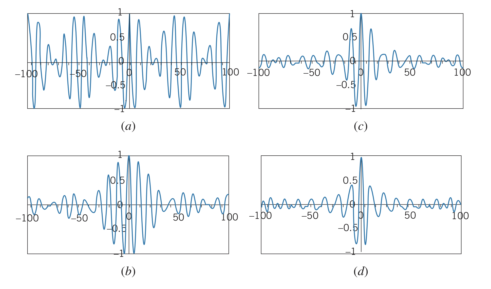

## Traveling Waves

Wave packets are **traveling waves**, which move through space with some uniform speed. Pictures only show wave packets at one instant in time, so a part of the wave that looks like it has no displacement will if the wave is moving.

## Constructing a Wave Packet

Waves can be added together to form a wave packet, forming a localized region of space that the wave takes up. Adding together two waves of amplitude $A$ and wave number $k$ ($k=2\pi/\lambda$) gives the function

$$y\left(x\right)=A_1\cos{\left(k_1x\right)}+A_2\cos{\left(k_2x\right)}=A_1\cos{\left(2\pi x/\lambda_1\right)}+A_2\cos{\left(2\pi x/\lambda_2\right)}$$

A phenomenon called **beats** occurs when sound waves of different frequencies are added. However, since we are still adding the waves from $-\infty$ to $+\infty$, there is no localized wave packet. Adding more waves, of increasing wavelength, would result in a narrower pulse resembling a wave packet, but it still continues forever in the $-\infty$ and $+\infty$ directions.

Notice that as more waves are added, the "wave packet" gets narrower, resembling the inverse relationship between location certainty and wavelength certainty.

For two waves of the same amplitude, $A=A_1=A_2$, the summed waves can be written as:

$$y\left(x\right)=2A\cos\left(\frac{\pi x}{\lambda_1}-\frac{\pi x}{\lambda_2}\right)\cos\left(\frac{\pi x}{\lambda_1}+\frac{\pi x}{\lambda_2}\right)$$

And if the wavelengths are close to each other ($\Delta \lambda=\lambda_2-\lambda_1{\lt\lt}\lambda_1,\lambda_2$), the equation can be approximated as:

$$y\left(x\right)=2A\cos\left(\frac{\Delta \lambda \pi x}{\lambda_{av}^2}\right)\cos\left(\frac{2\pi x}{\lambda_{av}}\right)$$

However, this still results in an infinite wave packet. Two approximations for finite wave packets are:

$$y\left(x\right)=\frac{2A}{x}\sin\left(\frac{\Delta \lambda \pi x}{\lambda_0^2}\right)\cos\left(\frac{2\pi x}{\lambda_0}\right)\newline y\left(x\right)=Ae^{-2\left(\Delta \lambda \pi x / \lambda_0^2\right)^2}\cos\left(\frac{2\pi x}{\lambda_0}\right)$$

### Adding waves of differing amplitudes and wavelength

Another approach is adding waves of different amplitudes and wavelengths (although wave numbers are more convenient: $k=2\pi/\lambda$):

$$y\left(x\right)=\sum A_i\cos{k_ix}$$

And summing over a continuous set of wave numbers gives

$$y\left(x\right)=\int A\left(k\right)\cos{kx}~dk$$