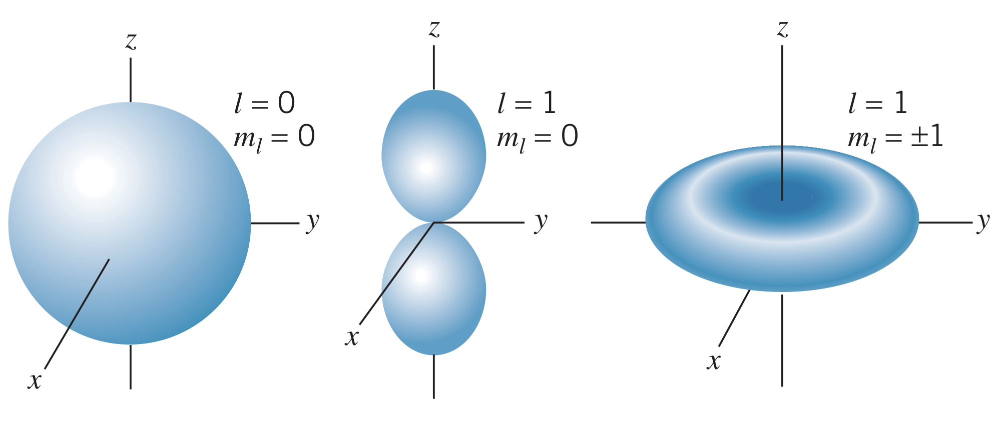

## What are the Angular Probabilty Densities?

The angular parts of the probability density function from the wave function is

$$P\left(\theta, \phi\right)=\left|\Theta_{l,m_l}\left(\theta\right)\Phi_{m_l}\left(\phi\right)\right|^2$$

Looking at the $l=0$ and $l=1$ angular probabilty density functions, we see that all are *cylindrically symmetric*, and the $l=0$ wave function is *spherically symmetric*:

For the $l=1$ wave functions, when $m_l=0$, the density function forms two regions along the $z$-axis. This makes sense given the fact that the direction of the angular momentum vector is in the $xy$-plane. Additionally, for the $m_l=\pm 1$ wave functions, the maximum projection of the angular momentum vector is along the $z$-axis, making the electrons spend most of their time near the $xy$-plane.