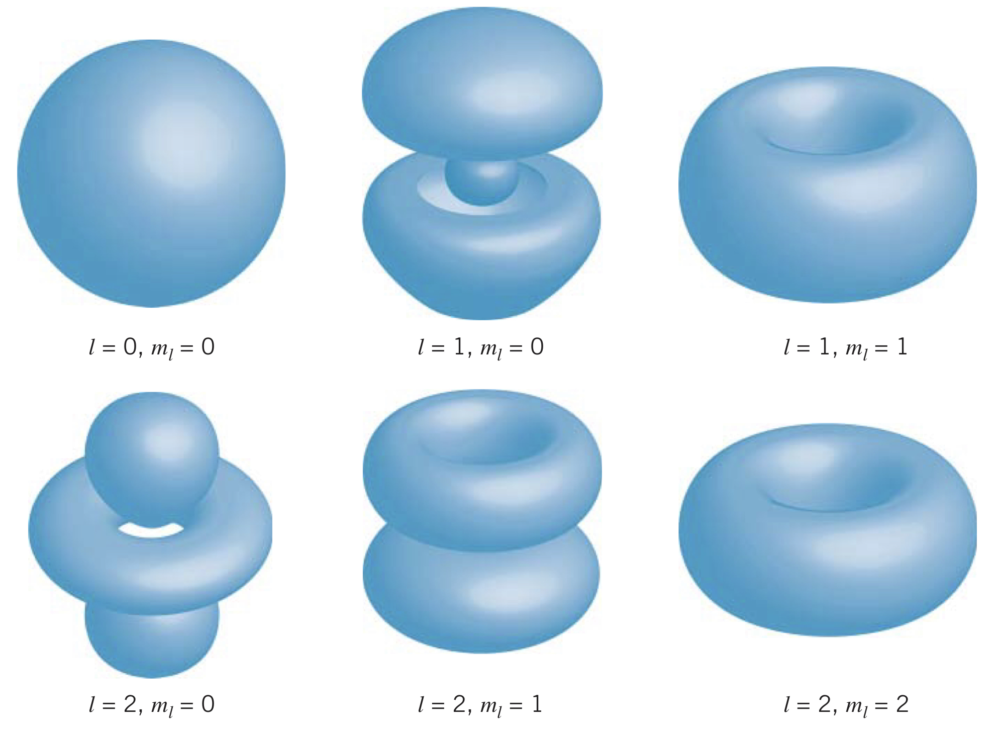

## Three-Dimensional Schrödinger Equation

In order to fully describe the hydrogen atom, we must use the three-dimensional Schrödinger equation. In Cartesian coordinates it is

$$-\frac{\hbar^2}{2m}\left(\frac{\partial^2\psi}{\partial x^2}+\frac{\partial^2\psi}{\partial y^2}+\frac{\partial^2\psi}{\partial z^2}\right)+U\left(x,y,z\right)\psi\left(x,y,z\right)=E\psi\left(x,y,z\right)$$

The usual way to solve such an equation would be to separate the variables by replacing a function of the three variables, $\psi\left(x,y,z\right)$, as a product of three functions, $X\left(x\right)Y\left(y\right)Z\left(z\right)$. However, the equation for Coulomb potential energy in three-dimensions, $U\left(x,y,z\right)=-e^2/4\pi\epsilon_0\sqrt{x^2+y^2+z^2}$ is not separable.

Instead, it is much easier to use spherical polar coordinates $\left(r,\theta,\phi\right)$. This results in the Schrödinger equation becoming

$$-\frac{\hbar^2}{2m}\left[\frac{\partial^2\psi}{\partial r^2}+\frac{2}{r}\frac{\partial\psi}{\partial r}+\frac{1}{r^2\sin{\theta}}\frac{\partial}{\partial\theta}\left(\sin{\theta\frac{\partial\psi}{\partial\theta}}\right)+\frac{1}{r^2\sin^2{\theta}}\frac{\partial^2\psi}{\partial\phi^2}\right]+U\left(r\right)\psi\left(r,\theta,\phi\right)=E\psi\left(r,\theta,\phi\right)$$

Note that the wave function $\psi$ is now written in terms of $r$, $\theta$, and $\phi$. Since the potential energy is described by $r$ only, the wave function can be factored as

$$\psi\left(r,\theta,\phi\right)=R\left(r\right)\Theta\left(\theta\right)\Phi\left(\phi\right)$$

where $R\left(r\right)$ is the *radial function*, $\Theta\left(\theta\right)$ is the *polar function*, and $\Phi\left(\phi\right)$ is the *azimuthal function*.

The quantum state of a particle whose potential energy is determined by only $r$ can be described as having angular momentum quantum numbers $l$ and $m_l$. The polar and azimuthal functions above can be solved using basic trigonometric functions, and the radial function is solved using the following differential equation:

$$-\frac{\hbar^2}{2m}\left(\frac{d^2R}{dr^2}+\frac{2}{r}\frac{dR}{dr}\right)+\left(-\frac{e^2}{4\pi\epsilon_0r}+\frac{l\left(l+1\right)\hbar^2}{2mr^2}\right)R\left(r\right)=ER\left(r\right)$$

Note: the mass, $m$, here is the *reduced mass* of the proton-electron system.

## Quantum Numbers and Wave Functions

Solving the three-dimensional Schrödinger equation results in three indices (or labels) which describe solutions (just like how the single index $n$ emerged when solving the one-dimensional version). These are the *quantum numbers* that describe the solutions.

One is $n$, the principle quantum number, which can take on values $1,2,3,...$. Another is the angular momentum quantum number, $l$, which can have values $0,1,2,...,n-1$. The third is the magnetic quantum number, $m_l$, which can have values $0,\pm 1,\pm 2,...,\pm l$.

The principle quantum number ($n$) is the sameas the quantum number $n$ found using the Bohr model, and can be used to quantize the energy levels:

$$E_n=-\frac{me^4}{32\pi^2\epsilon_0^2\hbar^2}\frac{1}{n^2}$$

### Quantum numbers in radial, polar, and azimuthal functions

Using the quantum numbers, the three-dimensional wave function can be separated as such:

$$\psi_{n,l,m_l}\left(r,\theta,\phi\right)=R_{n,l}\left(r\right)+\Theta_{l,m_l}\left(\theta\right)+\Phi_{m_l}\left(\phi\right)$$

### Degeneracy

The $n=2$ energy level has four different sets of quantum numbers: $\left(n=2,l=0,m_l=0\right)$, $\left(n=2,l=1,m_l=0\right)$, $\left(n=2,l=1,m_l=-1\right)$, and $\left(n=2,l=1,m_l=1\right)$. This means the $n=2$ energy level is *degenerate*. In general, the level with principle quantum number $n$ has a degeneracy of $n^2$.

Even though degenerate combinations have the same energy, different combinations of quantum numbers do not have *exactly* the same energy (it differs by about $10^-5$ eV). Additionally, the transitions between levels depends on the degeneracy. Finally, *each combination of quantum numbers corresponds to a very different wave function, representing very different state of motion of the electron*. The degeneracy of the energy level influences how the atom can form bonds, for instance.

## Probabilty Densities

Using the square of the three-dimensional wave function, $\left|\psi\left(r,\theta,\phi\right)\right|$ gives us the *volume probability density* at the location $\left(r,\theta,\phi\right)$. By using the volume element, $dV$, in spherical polar coordinates, we can find teh probability the electron is within a volume element:

$$\left|\phi_{n,l,m_l}\left(r,\theta,\phi\right)\right|^2dV=\left|R_{n,l}\left(r\right)\right|^2\left|\Theta_{l,m_l}\left(\theta\right)\right|^2\left|\Phi_{m_l}\left(\phi\right)\right|^2r^2\sin{\theta}~dr~d\theta~d\phi$$

Some examples of probability density functions can be seen below, where the uncertainty in the electron's position is visually represented as a volume.

