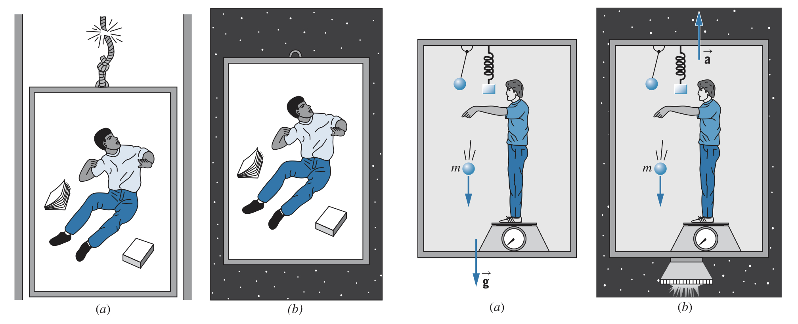
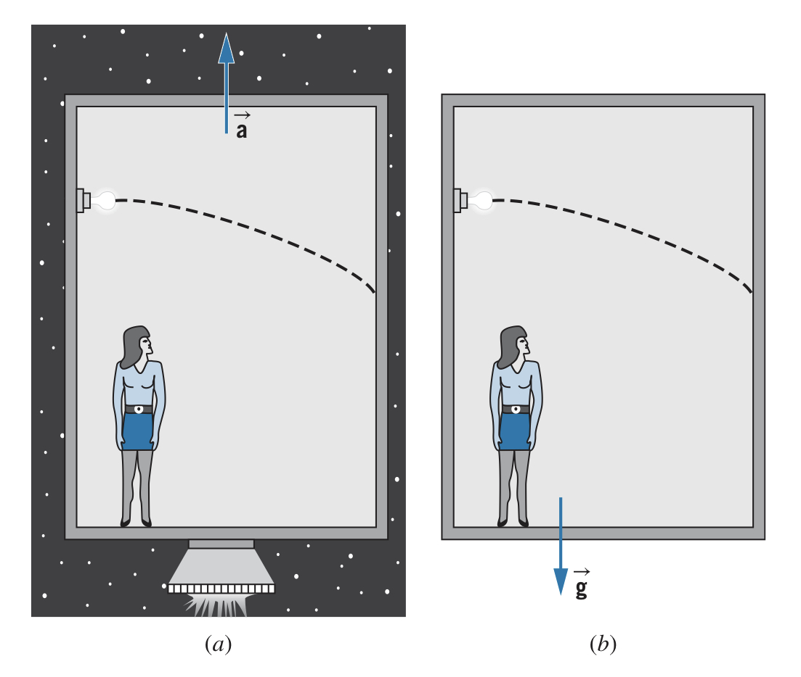

## The Origins of General Relativity

Albert Einstein proposed the thought experiment of a person falling freely being unable to experience their own weight. Einstein further expanded on this concept realizing that a person accelerating in a gravitational field is the same as no acceleration in no gravitational field. In other words, an acceleration $\bold{\overrightarrow{a}}$ of $\bold{\overrightarrow{g}}$ in a gravitational field of strength $\bold{\overrightarrow{g}}$ is equivalent to an acceleration of 0 in a negligible gravitational field.

Similarly, an accelerating frame of reference can produce the effects of a gravitational field. In one case, an observer is at rest on the surface of Earth, with a gravitational field of $\bold{\overrightarrow{g}}$. Another observer is in space (where the gravitational field is effectively 0) with an acceleration of $\bold{\overrightarrow{a}}=-\bold{\overrightarrow{g}}$. Every experiment done in these two frames of reference give the *exact* same results.

## The principle of equivalence

Leading from the thought experiment, we are led to the **principle of equivalence**: *There is no local experiment that can be done to distinguish between the effects of a uniform gravitational field in a non-accelerating inertial frame and the effects of a uniformly accelerating (non-inertial) reference frame.*

This principle appears at more introductory levels, like assuming that gravitational and inertial masses are the same. However, Einstein realized it works for all experiments, including those involving electromagnetic radiation. Here, a light wave of frequency $f$ emitted in an accelerating chamber of height $H$ moving at a velocity of $v$ (small when compared to $c$), there is an associated Doppler shift:

$$f'=f\frac{1+\Delta v/c}{1-\Delta v/c}\approx f\left(1+\Delta v/c\right)$$

Or, in terms of the frequency difference $\Delta f=f'-f$:

$$\frac{\Delta f}{f}=\frac{\Delta v}{c}=\frac{at}{c}=\frac{aH}{c^2}$$

Compared to the same experiment done in a gravitational field of strength $g$, there should be some shift

$$\frac{\Delta f}{f}=\frac{gH}{c^2}$$

Experiments done on Earth confirm this prediction to an incredible degree of precision. Further experiments have been done with atomic clocks, producing the same results. This is why GPS clocks need to be adjusted for this discrepancy to not lose accuracy.

This effect also occurs from light escaping stars, whose gravitational potential at the surface is $V=-GM/R$. The light observed on Earth is then shifted

$$\frac{\Delta f}{f}=\frac{\Delta V}{c^2}=-\frac{GM}{Rc^2}$$

This creates a red-shift as light escapes the gravitational field of stars. However, this effect is difficult to observe since it is minuscule compared to the motion-related red-shift effects.

## Space and Time

The difference between special relativity and general relativity is the removal of preference for an accelerated (non-inertial) frame of reference. General relativity works through the geometry of *spacetime*, the coordinate system combining space and time dimensions.

In general relativity, the presence of matter or energy causes spacetime itself to warp or curve. The motion of particles therefore follows this curve, changing their motion. Particles move along straight paths in spacetime; they may appear to be curved if spacetime itself is curved.

The *spacetime interval*, $ds$ is the separation between two events in spacetime. In two dimensional spacetime,

$$\left(ds\right)^2=\left(c~dt\right)^2-\left(dx\right)^2$$

Extending this to three dimensions, we get

$$\left(ds\right)^2=\left(c~dt\right)^2-\left(dx\right)^2-\left(dy\right)^2-\left(dz\right)^2$$

A curved surface in four-dimensional spacetime can be represented by

$$\left(ds\right)^2=g_0\left(c~dt\right)^2-g_1\left(dx\right)^2-g_2\left(dy\right)^2-g_3\left(dz\right)^2$$

where $g_i$ describe the curvature (in Euclidian nature, all $g_i=1$). Euclidian geometry is called *flat*, and all other non-Euclidian geometries have properties that differentiate it from a flat geometry like angles not adding to $180\degree$.

One experiment to test this theory of curved spacetime is to shine a line across a chamber. If the chamber is not moving or has some constant velocity, the light hits exactly opposite of where it is emitted. However, for the case of an accelerating chamber, the light will "dip" below where it would otherwise be.

General relativity gives the following relationship between curvature of spacetime and the density of mass and energy in space:

$$\text{curvature of space}=\frac{8\pi G}{c^4}\left(\text{mass-energy density}\right)$$

In classical mechanics, $c\rightarrow\infty$, meaning the curvature is nearly zero. Similarly, in weak gravitational fields, $G\rightarrow 0$, meaning the curvature is nearly zero. In the same way classical kinematics is the limit case of special relativity, Newtonian/classical gravitation is the limit case of general relativity.