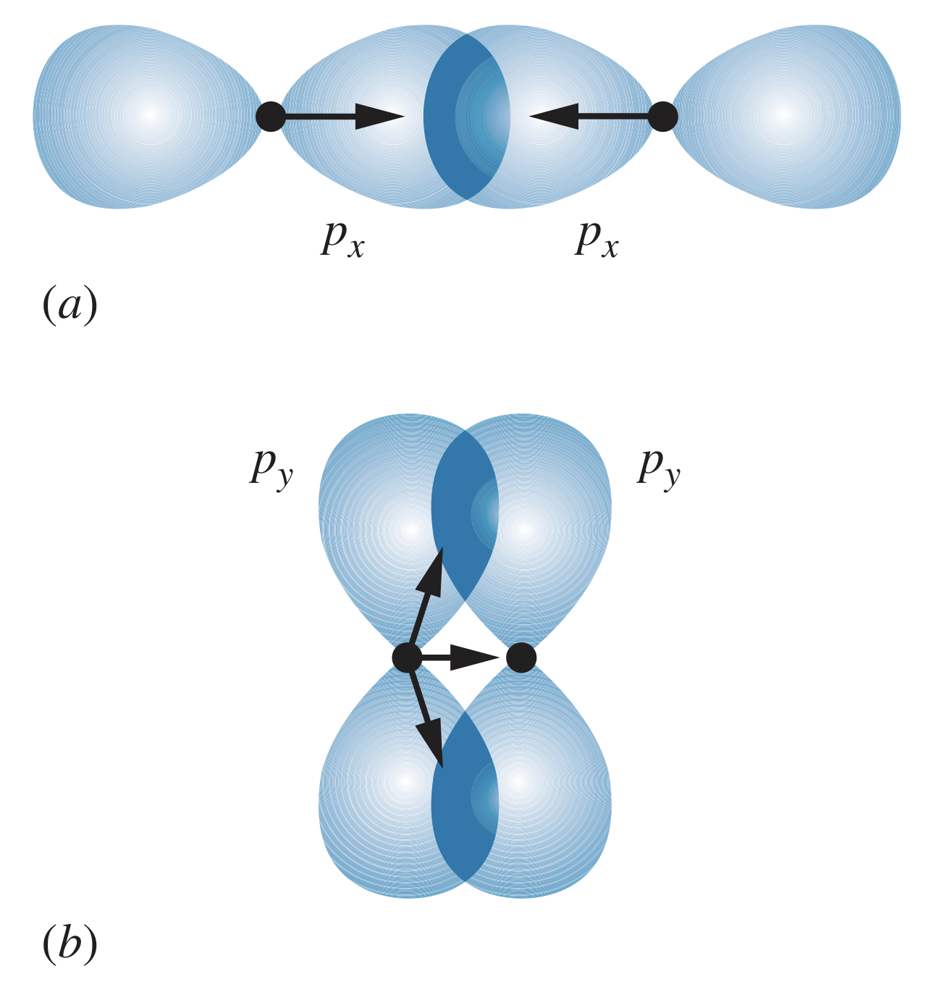
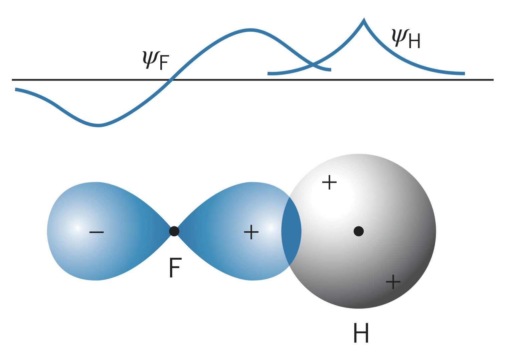
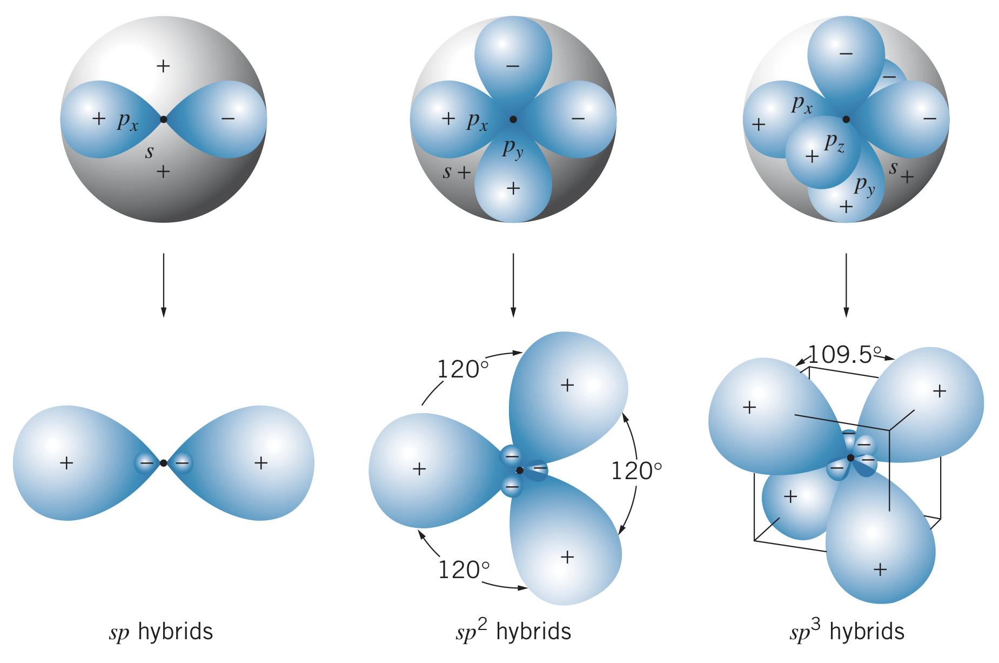
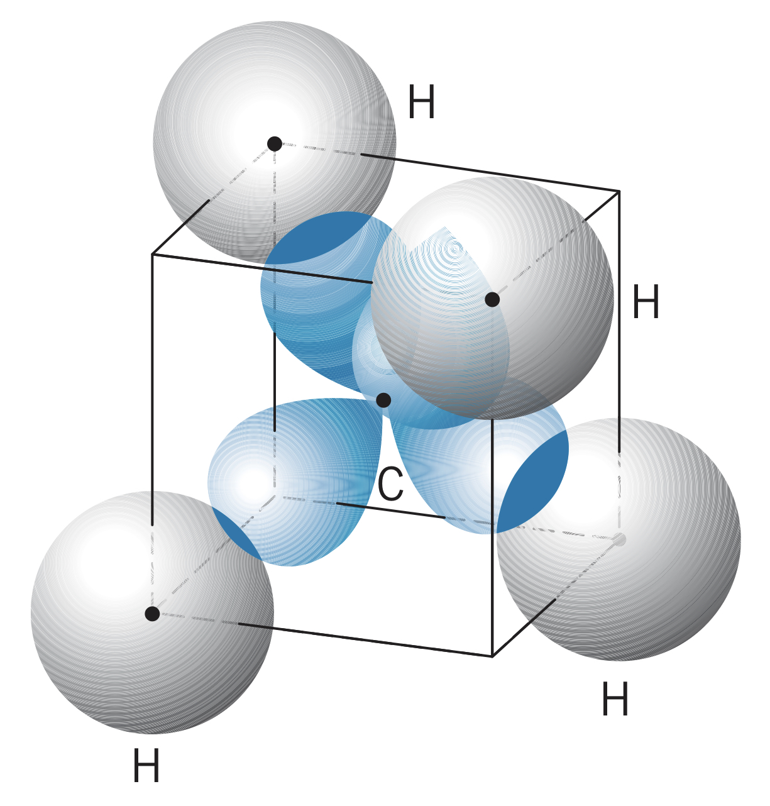
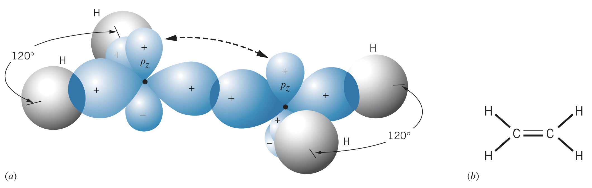
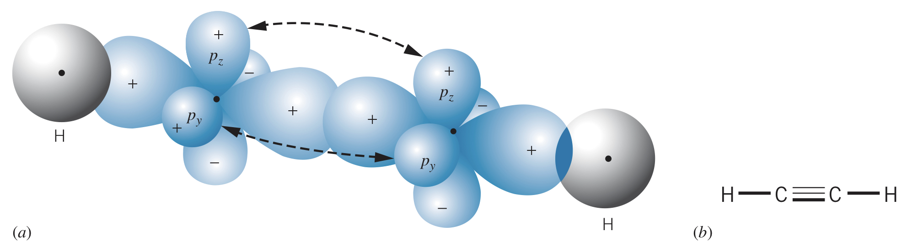

## Features of Covalent Bonding

When atoms in a molecule share electrons, they are **covalently bonding**. An example would be $\text{H}_2$, which has two identical atoms of hydrogen (called *homopolar* or *homonuclear* bonding).

Features of covalent bonding include:

1. As two atoms are brought together, the electrons interact and the separate atomic states and energy levels are transformed into molecular states
2. The electron wave functions overlap in such a way as to give a lower energy than the separated atoms had
3. The other molecular state has an increased energy relative to the separated atoms, and so does not lead to the formation of a stable molecule
4. The Pauli exclusion principle applies to molecular states; each state can have two electrons (one for each spin orientation)

### Dissociation energy

The **dissociation energy** of a molecule indicates the energy needed to break the molecule into neutral atoms.

As the atomic number increases, the $s$ electrons become associated with higher principle quantum numbers, $n$. This leads to lower dissociation energies since the equilibrium separation increases (due to higher average radius).

## $p$-states

Atoms with $p$ states can also form covalent bonds, and the three atomic $p$ states lead to six possible molecular $p$ states. The three values of $m_l$ lead to the three "figure-eight" shaped distributions for $p$ states: for $m_l=0$ we see a distribution with two lobes aligned with the $z$-axis. For $m_l=\pm 1$, we observe a smeared out figure-eight distribution in the $xy$-plane due to the uncertainty principle. Instead of $m_l$ values, we use $p_x$, $p_y$, and $p_z$ to represent these distributions (even though the $x$ and $y$ ones cannot be observed, they do exist).

There are three types of covalent bonds for $p$ types: $pp$ bonds, $sp$ directed bonds, and $sp$ hybrid states.

## $pp$ Covalent Bonds

Bringing two atoms with $p$ states together overlaps their probability distributions along one of the axes (assuming they approach along the $x$-axis is convention). The $p_x$ states overlap, producing a significant attractive force between the nuclei and electrons. The $p_y$ and $p_z$ states also overlap, but in such a way that their attractive forces are far less significant than those of the $p_x$ states.

The bonds with a more direct overlap of $p$ states (such as $a$ in the image above) are known as **sigma bonds**, denoted $\sigma$. The bonds with an indirect, off-axis overlap (such as $b$ in the image above) are known as **pi bonds**, denoted $\pi$. In general, $\sigma$ bonds are stronger than $\pi$ bonds.

### Energies

Consider the bonding of two atoms with filled $1s$ and $2s$ states and valence electrons in the $2p$ state. The four $1s$ electrons occupy the bonding and anti-bonding *molecular* states, and same with the $2s$ electrons. This leaves the $p$ state electrons, which begin filling the bonding (lower energy) states. Two electrons can fill each $pp$ covalent bond ($p_x$, $p_y$, $p_z$) before filling the antibonding states.

## $sp$ Molecular Bonds

It is possible for a stable molecule to form with an atom with an $s$-state valence electron and one with one or more $p$-state valence electrons. Fluorine, for instance, has five electrons in the $p$ shell, so it has four paired electrons (two of the $2p$ states reached capacity), meaning one electron participates in bonding. This creates a lobe-shaped wave function where the signs are opposite on different lobes (one is positive, one is negative). Another atom, such as hydrogen, can bond to the fluorine by overlapping wave functions in such a way that increase the probability of finding an electron in between the atoms (bonding $sp$ state). The other overlapping direction is the antibonding $sp$ state.

### Directed bonds

In a water molecule ($\text{H}_2\text{O}$), there are four $p$ electrons. They fill one $p$ state completely, leaving two half-filled with one electron each. This allows two bonds with hydrogen, forming the molecule. Water has *directed* bonds since the relative positions and directions of the bonds are fixed.

## $sp$ Hybrid States

Some atoms with $p$ electrons behave as though they have more valence electrons than expected. Carbon, for instance, has an electron configuration of $1s^2~2s^2~2p^2$, however it forms bonds as though it has four valence electrons. This effect is known as *sp hybridization*. The bonds these atoms form are *identical*, not as if there are two $ss$ bonds and two $sp$ bonds for instance.

$sp$ hybrids usually form as follows:

1. In an atom with a configuration of $2s^2~2p^n$, one of the $2s$ electrons is excited to the $2p$ shell, giving a configuration of $2s^1~2p^{n+1}$
2. The hybrid states are formed by taking equal mixtures of the wave functions representing the $2s$ state and each of the $2p$ states. For instance, boron (configuration $2s^2~2p^1$) first becomes $2s^1~2p^2$, meaning the hybrid states are represented as different combinations of $\psi_{2s}$, $\psi_{2p_x}$, and $\psi_{2p_y}$.

### Examples

In $\text{CH}_4$, the carbon has four $sp^3$ hybrid states, each of which forms a bond ($\sigma$) with a hydrogen. This gives a tetrahedral structure.

Carbon can also form three $sp^2$ hybrid states, allowing two carbon atoms to bond to two hydrogens each and double bond with each other (one $\sigma$ and one $\pi$).

It is even possible for two carbons to form $sp$ hybrids, allowing one hydrogen each with a triple bond between the two carbons.

