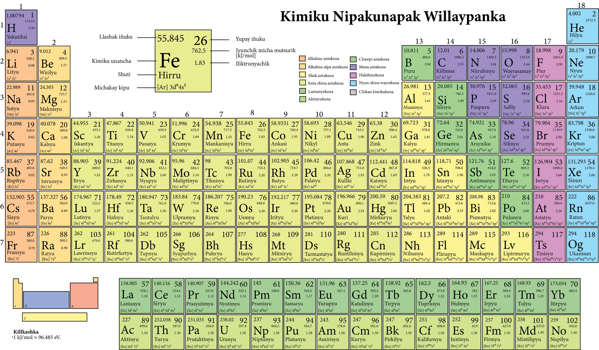

## Atomic Subshells

Looking at the energies for electron orbitals show a pattern where the $1s$ orbital has the least energy, followed by the $2s$ and $2p$ orbitals whose energies are relatively close to one another. This pattern continues with higher energy levels, where different orbitals are almost grouped together with the same energies.

## Penetrating Orbits

Two of the $n=3$ orbitals ($3s$ and $3p$) penetrate the inner orbits (meaning they have a large probability density for small values of $r$) significantly. The $3d$ orbital however has negligible penetration, and so has a much higher energy than the other two $n=3$ orbitals.

The same phenomenon occurs with the $n=4$ orbitals, where the $4s$ and $4p$ subshells penetrate so much that their energies almost coincide with the $3d$ orbital.

Although penetrating orbits spend more time closer to the nucleus than non-penetrating ones, they also spend more time farther away, averaging out to approximately the same average radius.

## Atomic Shells

The set of orbitals with a certain value of $n$ is called an **atomic shell**. They are designated by letter, as shown below:

| $n$ | $1$ | $2$ | $3$ | $4$ | $5$
|-----|-----|-----|-----|-----|-----
| Shell | $K$ | $L$ | $M$ | $N$ | $O$

Levels with certain values of $n$ and $l$ are called **subshells**, such as $3s$ or $4d$. The maximum number of electrons allowed in each of these levels is $2\left(2l+1\right)$. Below is a table with some atomic subshell capacities:

| $n$ | $l$ | Subshell | Capacity
|-----|-----|-----|-----
| $1$ | $0$ | $1s$ | $2$
| $2$ | $0$ | $2s$ | $2$
| $2$ | $1$ | $2p$ | $6$
| $3$ | $0$ | $3s$ | $2$
| $3$ | $1$ | $3p$ | $6$
| $4$ | $0$ | $4s$ | $2$
| $3$ | $2$ | $3d$ | $10$
| $4$ | $1$ | $4p$ | $6$
| $5$ | $0$ | $5s$ | $2$
| $4$ | $2$ | $4d$ | $10$
| $5$ | $1$ | $5p$ | $6$
| $6$ | $0$ | $6s$ | $2$
| $4$ | $3$ | $4f$ | $14$
| $5$ | $2$ | $5d$ | $10$
| $6$ | $1$ | $6p$ | $6$
| $7$ | $0$ | $7s$ | $2$
| $5$ | $3$ | $5f$ | $14$
| $6$ | $2$ | $6d$ | $10$

Note: these tables only represent the "outer" or *valence* electrons since they describe how electrons fill the shells. The properties of electrons change as the $Z$ of an atom changes For instance the nineteenth electron of potassium ($Z=19$) is very different from the nineteenth electron of lead ($Z=82$). Instead, we describe the inner electrons by shells, such as the $K$ shell.

## The Periodic Table

The periodic table arranges all the elements by increasing atomic number ($Z$) such that the vertical columns (*groups*) contain elements with similar properties.

## Electron Configurations

We have seen that to fill electronic subshells, there are two rules:

1. The capacity of each subshell is $2\left(2l+1\right)$, called the Pauli exclusion principle
2. The electrons must occupy the lowest energy states available

Electron configurations are written for each element using a notation to identify the subshell and number of electrons it contains. For instance, hydrogen has an electron configuration of $1s^1$, since it has one electron in the $1s$ suborbital.

In general, orbitals are filled in order, however there are some discrepancies such as copper ($Z=29$), which would be expected to fill the $4s$ suborbital before the $3d$ suborbital. However, an electron completing the $3d$ orbital requires slightly less energy, so copper's electron configuration is $1s^2~2s^2~2p^6~3s^2~3p^6~3d^{10}~4s^1$.