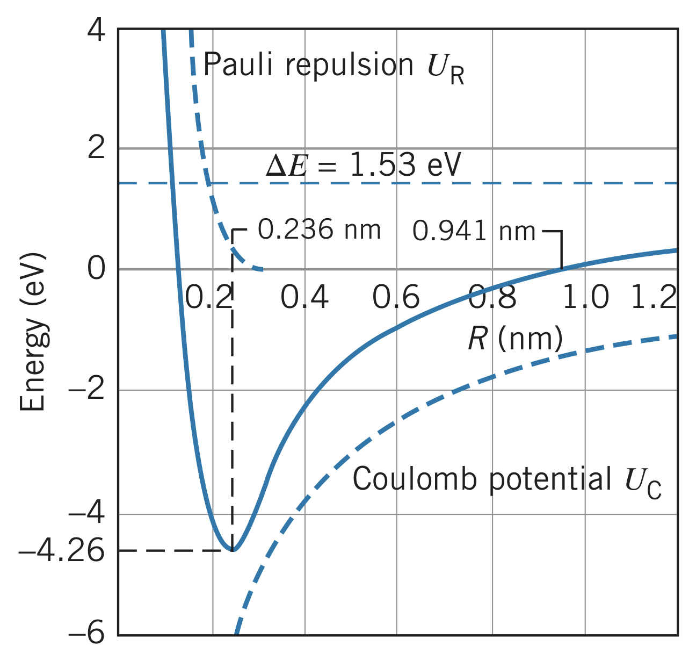

## What is an Ionic Bond?

Unlike covalent bonding, in ionic bonding, the bonding electron(s) spend almost all of their time around one of the atoms instead of being "shared." Consider $\text{NaCl}$, which has a sodium ($1s^2~2s^2~2p^6~3s^1$) and chlorine ($1s^2~2s^2~2p^6~3s^2~3p^5$) atom. Removing one electron from the sodium requires $5.14~\text{eV}$ (its ionization energy), but adding an electron to chlorine releases $3.61~\text{eV}$ (its electron affinity). This leaves $\text{Na}^+$ and $\text{Cl}^-$. Brining these two ions close to one another recovers the remaining energy ($1.53~\text{eV}$) "spent" on the bond:

$$R=-\frac{e^2}{4\pi\epsilon_0}\frac{1}{U}=\frac{1.44~\text{eV}\cdot\text{nm}}{1.53~\text{eV}}=0.941~\text{nm}$$

Therefore, having the ions at some distance less than $0.941~\text{nm}$ requires less energy than having the *atoms* at the same distance. However, pushing them even closer eventually requires even more energy due to the repulsive force between electrons and the Pauli exclusion principle. There is some equilibrium distance, $R_{eq}$, where these forces are balanced and the bond is at its lowest energy.

## Ionic or Covalent?

Ionic and covalent bonding are extremes of chemical bonding: in ionic bonding, the electrons spend almost all their time around one atom whereas in covalent bonding the electrons are shared. The type of bonding atoms will participate in depends on the atoms' willingness to give up their electrons.

### Homonuclear diatomic molecules

Since both atoms are exact the same, we can't expect one to dominate the other in ionic bonding. Therefore, homonuclear diatomic molecules are always covalent in nature.

### Heteronuclear molecules

Since atoms are different in heteronuclear molecules, there is no perfectly ionic or perfectly covalent bond. Instead, there can be some slight negative charge due to the electrons spending more time closer to one atom than another. Similarly, even in ionic bonds, since wave functions do not suddenly drop to zero, there is always some level of covalent bonding.

## Electric Dipole Moments

To measure the relative ionic character of a molecule is based on its electric dipole moment. An electric dipole moment, $p$, is defined as two charges $+q$ and $-q$ separated by a distance $r$:

$$p=qr$$

In a purely covalent bond, there is no excess charge on either atom ($q=0$), meaning the dipole moment is expected to be zero. However, in ionic molecules, there is a net positive charge on one atom and a net negative charge on the other.

For $\text{NaCl}$:

$$p=qR_{\text{eq}}=\left(1.60\cdot10^{-19}~\text{C}\right)\left(0.236\cdot10^{-9}~\text{m}\right)=3.78\cdot10^{-29}~\text{C}\cdot\text{m}$$

Note: this value is slightly off since $\text{NaCl}$ is not a purely ionic molecule.

### Fractional ionic character

By taking a fraction of the measured electric dipole moment over the calculated theoretical electric dipole moment, we get the **fractional ionic character**:

$$\text{fractional ionic character}=\frac{p_{\text{measured}}}{qR_{\text{eq}}}$$

## Electronegativity

The **electronegativity** of an atom is the capability of an atom to attract electrons when it forms chemical bonds. It can be computed by summing the energy cost of removing an electron and the energy gain in adding an electron.

Two atoms with equal electronegativities have equal tendencies to attract electrons and so form covalent bonds. If two atoms' electronegativities were significantly different, there will be at least some ionic character to their bond.