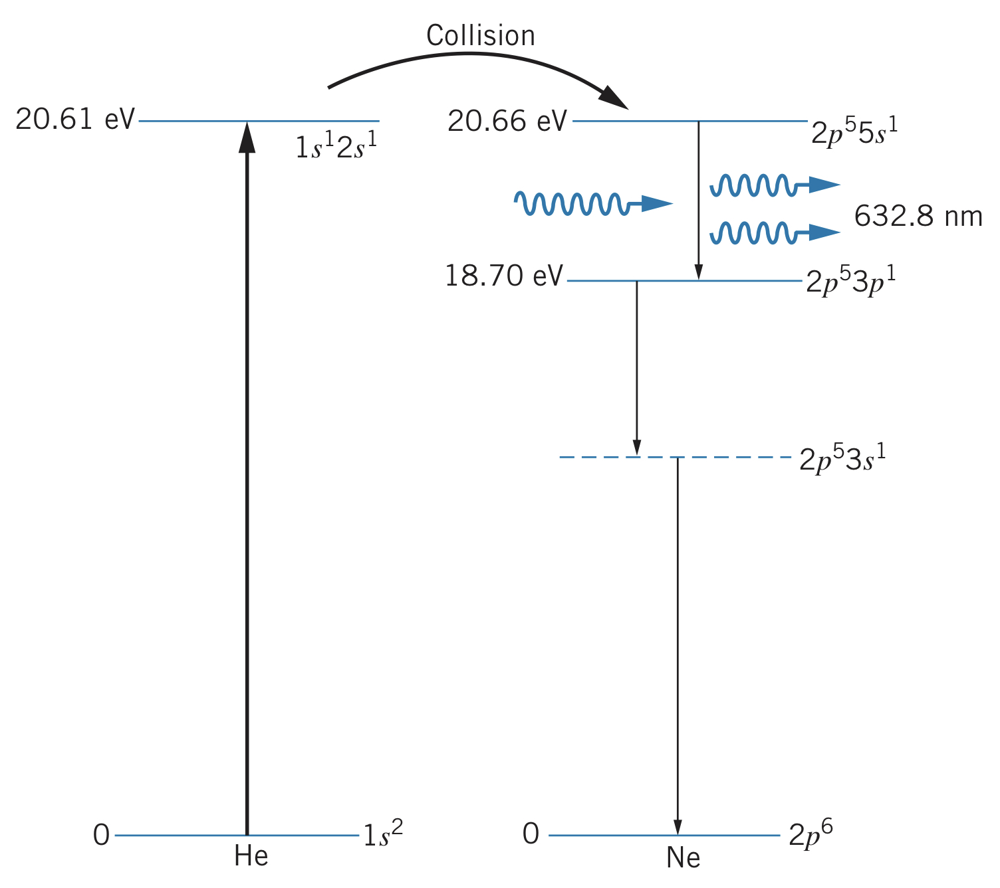
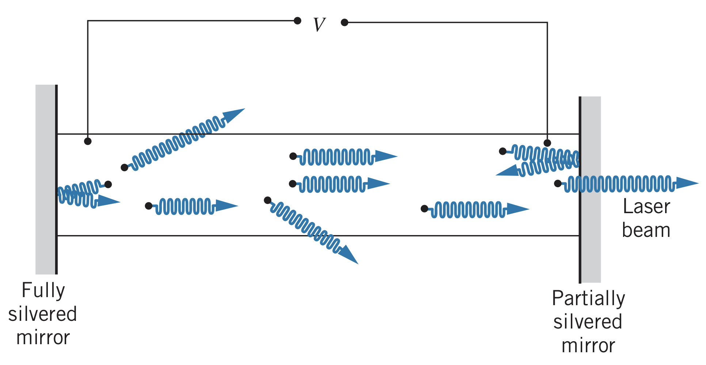

## Radiation Interactions

Radiation can interact with atomic energy levels in three ways. For one, an atom in an excited state can transition to a lower energy state, releasing a photon (called **spontaneous emission**):

$$\text{atom}^*\rightarrow\text{atom}+\text{photon}$$

where the asterisk represents an excited state.

Another interaction is called **induced absorption**, and occurs when an atom in its ground state absorbs a photon, making the transition to an excited state:

$$\text{atom}+\text{photon}\rightarrow\text{atom}^*$$

The third interaction is called **induced (stimulated) emission**. It occurs when a photon of the right energy (equal to the energy difference of the two levels) passes an atom in an excited state. This induces the atom to emit the photon earlier than it otherwise would, making the transition to the ground state.

$$\text{atom}^*+\text{photon}\rightarrow\text{atom}+\text{2 photons}$$

Note: the two photons travel in the exact same direction with the exact same energy and are *coherent*, meaning their associated electromagnetic waves are perfectly in phase.

## Lasers

Imagine a collection of excited atoms, all in the same excited state. A photon passing one atom results in photons being emitted, exciting more atoms, etc. until an intense beam of photons is produced all in the same direction. This is a *laser* (laser is an acronym standing for Light Amplification by Stimulated Emission of Radiation).

While simple, this model does not actually work in practice since it is difficult to keep the atoms in their excited states until stimulated (we do not want any spontaneous emission). Additionally, atoms in their ground state could absorb the radiation, removing photons.

### Three-level atom

To solve these problems, there must be *population inversion*, where a collection of atoms has more atoms in the upper state than the lower state. One way to achieve this is by using a so-called three-level atom. In a three-level atom, atoms are excited to a short-lived energy state, quickly decay to a metastable state, where they remain for a relatively long time until they can be stimulated by a passing photon.

Once the lasing transition occurs, however, there will be more atoms in the ground state than the metastable state, removing photons that could contribute to lasing action.

### Four-level atom

One way to fix this problem is by using a four-level atom, where the ground state is pumped to a short-lived excited state just like in a three-level atom. This short-lived state decays into the metastable state, then undergoes the lasing transition to yet another short-lived state, then decaying into the ground state again. This means the atoms in the ground state cannot absorb the energy by the lasing transitions, preventing the problem where photons were removed.

A popular version of the four-level laser is the helium-neon laser, which works with a mixture of helium and neon gas. An electrical current pumps the helium from its ground state to the excited state, then the atoms remain in the metastable state for a while since a $2s$ electron cannot return to the $1s$ state by photon emission. Occasionally, an excited helium atom collides with a ground-state neon atom, transferring about $20.6\text{eV}$ of excitation energy to the neon atom. Since neon happens to have an excited state at $20.6\text{eV}$, the helium atom returns to its ground state:

$$\text{helium}^*+\text{neon}\rightarrow\text{helium}+\text{neon}^*$$

In the excited state of neon, one electron moves from the $2p$ subshell to the $5s$ subshell. It then decays to the $3s$ level and eventually the $2p$ ground state.

There are always more neon atoms in the $5s$ state than $3p$ state due to the match with the helium excited state, meaning there is always the population inversion needed for the laser.

When a neon atom in the $5s$ state spontaneously emits a photon, the laser effect begins since it stimulates other atoms. Using mirrors, a beam of photons is collected along the axis of the glass tube.

