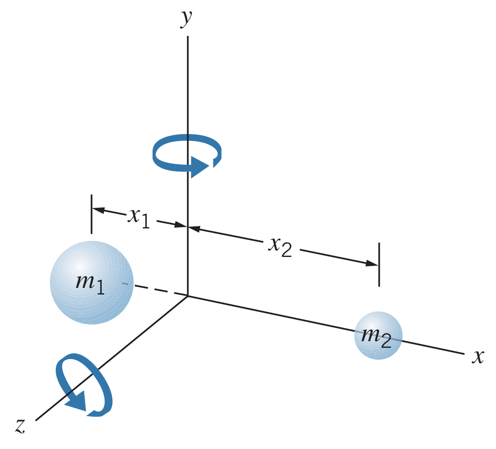

## Rotations in Quantum Mechanics

In classical physics, a rotor with rotational inertial $I$ has rotational kinetic energy $K=\frac{1}{2}I\omega^2=L^2/2I$, where $L=I\omega$ is the rotational angular momentum. There is no obvious analogy in quantum mechanics, but we can imagine a particle of mass $m$ rotating on the end of a rod of length $r$. However, in quantum mechanics it is not possible to have rotations in a fixed plane (due to the uncertainty relationship), so we instead imagine a particle confined to move in three dimensions on a sphere of radius $r$.

The resulting energies take the form

$$E_L=\frac{L\left(L+1\right)\hbar^2}{2I}~~~~L=0,1,2,3,...$$

where $L$ is the angular momentum quantum number. The rotational levels have energies $0, 2\left(\hbar^2/2I\right), 6\left(\hbar^2/2I\right), 12\left(\hbar^2/2I\right),...$ (note: not equally spaced).

We can then find the kinetic energy by replacing classical angular momentum with quantum angular momentum $\left|\boldsymbol{\overrightarrow{L}}\right|=\sqrt{L\left(L+1\right)}\hbar$. Note: $L$ is used to represent the angular momentum quantum number of a *system* whereas $l$ is used to represent the angular momentum quantum number of a *particle*.

Much like the vibrational states, there is a selection rule for rotational states too:

$$\text{Rotational selection rule:}~~~~\Delta L=\pm 1$$

## Rotating Diatomic Molecules

Imagine a diatomic molecule whose center of mass is at the origin ($x_1m_1=x_2m_2$). 

The rotational inertia is $I=m_1x_1^2+m_2x_2^2$, or, using the reduced mass $m=m_1m_2/\left(m_1+m_2\right)$ and equilibrium separation $R_{\text{eq}}=x_1+x_2$:

$$I=mR_{\text{eq}}^2$$

Plugging this into the energy states, we get

$$E_L=\frac{L\left(L+1\right)\hbar^2}{2mR_{\text{eq}}^2}=BL\left(L+1\right)$$

where $B$ is the *rotational parameter*, defined for diatomic molecules as

$$B=\frac{\hbar^2}{2mR_{\text{eq}}^2}$$

The energy absorbed or emitted must follow the selection rule and transition between adjacent levels, so

$$\Delta E=E_{L+1}-E_L=B\left(L+1\right)\left(L+2\right)-BL\left(L+1\right)=2B\left(L+1\right)$$

Here again we see that the spacing between energy levels depends on $L$ itself rather than being equally spaced as it is in vibrational transitions. Emitted photons can have energies $2B,4B,6B,...$.