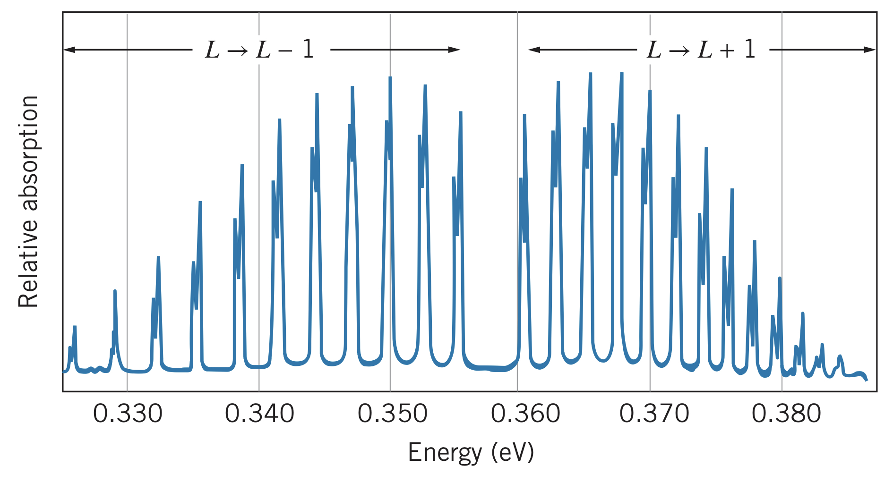

## Molecular Transitions

A molecule can transition between electronic states when excited by a photon. However, the energy required to transition between electronic states is on the order of electron-volts. Within an electronic state, there are vibrational states (on the order of $0.1-1~\text{eV}$) and rotational states (on the order of $0.01-0.1~\text{eV}$).

Most molecules have both vibrational and rotational states, represented by vibrational quantum number $N$ and rotational quantum number $L$. These molecules must follow both selection rules:

$$\left|\Delta N\right|=1~~~~~\text{and}~~~~~\left|\Delta L\right|=1$$

Since all transitions must satisfy both these requirements, transitions to the next lowest rotational state, for instance, are not allowed (i.e. $N=1,L=4$ to $N=1,L=3$). Instead, the molecule would need to transition to $N=0,L=3$ or $N=0,L=5$ for example.

## Energy

The energy of one of these states is found as

$$E_{NL}=\left(N+\frac{1}{2}\right)hf+BL\left(L+1\right)$$

where

$$N=0,1,2,...~~~~~L=0,1,2,...$$

Since the vibrational term is usually larger than the rotational term, the emission wavelengths typically correspond to $N\rightarrow N-1$ with $L\rightarrow L\pm 1$. The absorption wavelengths will be one where $N$ increases by one unit.

For an absorption from $N,L$ to $N+1,L\pm 1$, the possible energies are

$$\Delta E=E_{N+1,L\pm 1}-E_{NL}\newline\Delta E=\left[\left(N+\frac{3}{2}\right)hf+B\left(L\pm 1\right)\left(L\pm 1+1\right)\right]-\left[\left(N+\frac{1}{2}\right)hf+BL\left(L+1\right)\right]\newline\Delta E=hf+2B\left(L+1\right)~~~~~\text{for }L\rightarrow L+1\newline\Delta E=hf-2BL~~~~~\text{for }L\rightarrow L-1$$

According to the energies above, absorption photons can have energies $hf+2B$, $hf+4B$, $hf+6B$, $...$ , but also $hf-2B$, $hf-4B$, $hf-6B$, $...$ . Note: $hf$ is missing since it would represent a pure vibrational transition, which is not allowed.

### Example: $\text{HCl}$

Below is the absorption spectrum of $\text{HCl}$:

Notice a few qualities where this differs from the ideal version:

1. Transitions are not exactly an energy of $2B$ apart. In fact, the energies decreased moving away from the center. This is because the bond can stretch slightly when rotating at such speeds, increasing the value of $R_{\text{eq}}$.
2. The heights of the peaks are different. This is because the heights represent the intensity of the transitions, which depends on the population of the particular origin level. Since these decrease according to the Maxwell-Boltzmann distribution factor $e^{-E/kT}$, they are not exactly equal. Additionally, the degeneracy of each level has an effect on the population, according to

$$p\left(E_{NL}\right)=\left(2L+1\right)e^{-E_{NL}/kT}=\left(2L+1\right)e^{-\left[\left(N_1/2\right)hf+BL\left(L+1\right)\right]/kT}$$

Note: the level with maximum intensity can be found by locating when $dp/dL=0$:

$$2L+1=\sqrt{\frac{2kT}{B}}$$

3. Each peak looks like two very close peaks. This is because chlorine has two isotopes, one with a mass of $35~\text{u}$ and another with a mass of $37~\text{u}$. The heavier one has slightly smaller energies since it takes more energy to vibrate and rotate it. The intensity has to do with the relative abundance of each isotope.

## Significance

Just like how atomic spectroscopy helps identify atoms from their characteristic emission and absorption spectra, molecular spectroscopy helps identify molecules by which wavelengths of radiation they can absorb and emit. This gives each molecule a unique fingerprint which can be used to determine the composition of a material.