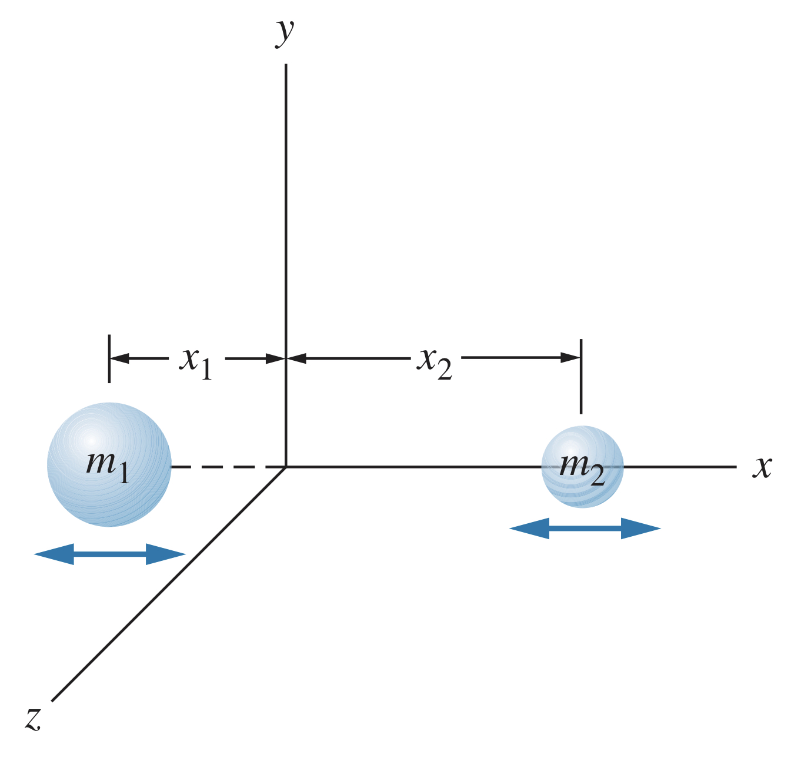

## Vibrations in Quantum Mechanics

In a classical system, a vibrating system as an object of mass $m$ on a spring of force constant $k$ has an oscillation frequency $\omega=\sqrt{k/m}$. It has an associated energy $U=\frac{1}{2}kx^2$, and a maximum amplitude of $x_m$, meaning it has a (constant) total energy of $E=\frac{1}{2}kx_m^2$.

Quantum oscillators have only certain allowed energies:

$$E_N=\left(N+\frac{1}{2}\right)\hbar\omega=\left(N+\frac{1}{2}\right)hf~~~~N=0,1,2,3,...$$

The ground-state energy ($N=0$) is therefore $\frac{1}{2}\hbar\omega=\frac{1}{2}hf$, and each energy level is spaced by $\hbar\omega=hf$. Note: there is no energy state where $E=0$ (since this would have a displacement of exactly zero and momentum of exactly zero, violating the uncertainty principle). Instead, the minimum energy $\frac{1}{2}hf$ is often called the *zero-point energy*.

### Allowed transitions

The oscillator can absorb or emit radiation to jump to different states. However, these states must differ in $N$ by exactly one unit. This is called a *selection rule*.

$$\text{Vibrational selection rule:}~~~~\Delta N=\pm 1$$

## Vibrating Diatomic Molecules

Imagine a diatomic molecule oscillating. 

The two atoms have masses $m_1$ and $m_2$ and effective force constant $k$. At the equilibrium, the only energy is kinetic energy so

$$E_T=\frac{1}{2}m_1v_1^2+\frac{1}{2}m_1v_1^2=\frac{p_1^2}{2m_1}+\frac{p_2^2}{2m_2}$$

By using a frame of reference where the center of mass of the molecule is constant, the total momentum must be zero. Therefore $p_1=p_2=p$, meaning

$$E_T=\frac{1}{2}p^2\left(\frac{1}{m_1}+\frac{1}{m_2}\right)=\frac{1}{2}p^2\left(\frac{m_1+m_2}{m_1m_2}\right)=\frac{p^2}{2m}$$

where

$$m=\frac{m_1m_2}{m_1+m_2}$$

This represents the system as if it were a single mass $m$ moving with momentum $p$. The $m$ can be thought of as an effective mass, known as the *reduced mass*, and it is used when dealing with the vibration of the molecule.

Note: when the masses are the same, $m=m_1/2$, which makes sense because the atoms both move equally. In a situation where one atom is much greater mass than the other, the reduced mass is about equal to the smaller mass (since the larger atom has significant inertia).