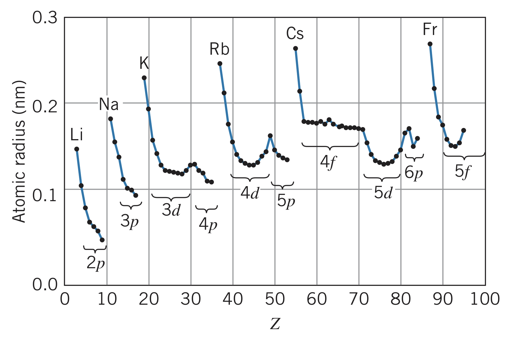
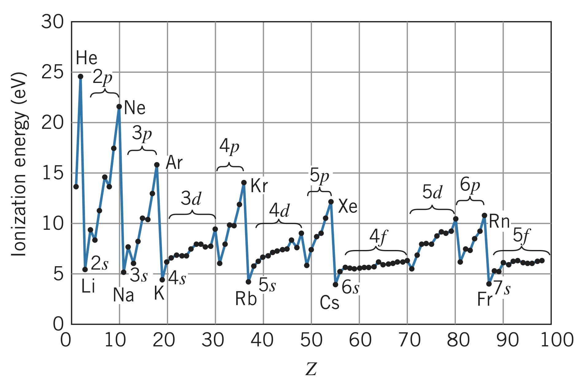
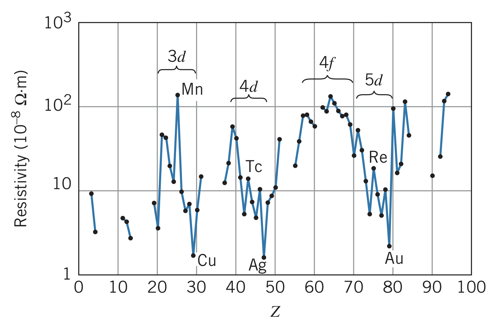
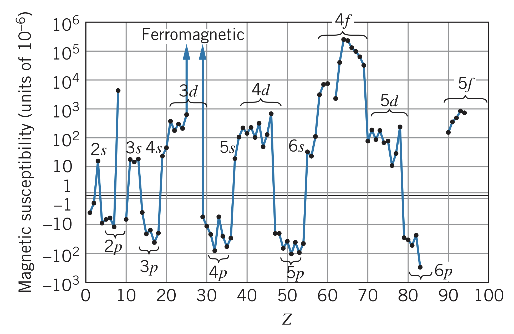

Our knowledge of atomic structure and the physical and chemical properties of elements is based on the following two assumptions:

1. Filled electron subshells are very stable configurations. Atoms with one extra electron beyond that easily give up that electron to return to this stable state. Similarly, atoms lacking one electron in a shell easily accept another electron to complete that subshell.
2. Filled electron subshells do not normally contribute to chemical or physical properties of the atom. Only outer electrons (in unfilled subshells) affect the properties of the atom. Sometimes only one outer electron is the primary factor of the entire atom's properties.

## Atomic Trends

Using these assumptions, we can build predictions about the physical properties of atoms.

### Atomic radius

The radius of an atom is difficult to measure due to the uncertainty surrounding the location of the electrons and the fact that different kinds of experiments result in different radii. One way atomic radius is measured is by using the average spacing between atoms in a crystal. Here is the trend of atomic radius for increasing atomic number $Z$:

### Ionization energy

Below is the trend of ionization energy with increasing atomic number $Z$:

### Electrical resistivity

In a material, electric current $i$ flows across a potential difference $V$ according to $V=iR$, where $R$ is the electrical resistance of the material. Assuming a uniform length $L$ and cross-sectional area $A$, the resistance is

$$R=\rho\frac{L}{A}$$

where $\rho$ is the *resistivity*, measured in $\Omega\cdot m$. Good electrical conductors have a small resistivity (for copper, $\rho=1.7\cdot 10^{-8}~\Omega\cdot m$) and poor conductors have large resistivities (for sulfur, $\rho=2\cdot 10^{15}~\Omega\cdot m$). In terms of atoms, the current that can flow depends on the movement of loosely bound electrons, such as $s$ electrons. Below is the trend of electrical resistivity with increasing atomic number $Z$:

### Magnetic susceptibility

When a material is place into a magnetic field of intensity $B$, the material becomes "magnetized" with magnetization $M$, which is (for many materials) proportional to $B$:

$$\mu_0M=\chi B$$

where $\chi$ is called the *magnetic susceptibility*. Materials where $\chi\gt 0$ are called *paramagnetic* and those where $\chi\lt 0$ are called diamagnetic. Materials that retain permanently magnetized are called *ferromagnetic* and their $\chi$ is undefined.

Magnetism depends on both $\boldsymbol{\overrightarrow{L}}$ and $\boldsymbol{\overrightarrow{S}}$ of the electrons in unfilled subshells because of the magnetic moments $\boldsymbol{\overrightarrow{\mu}}_L$ and $\boldsymbol{\overrightarrow{\mu}}_S$. This effect is responsible for paramagnetic susceptibilities, when $\boldsymbol{\overrightarrow{L}}$ or $\boldsymbol{\overrightarrow{S}}$ is non-zero. Diamagnetism occurs when a varying magnetic field occurs in an area bounded by an electric circuit, causing an *induced current* in the circuit. This induced current sets up a magnetic field opposing change in the applied field (Lenz's law). In an atom, the circuit is the circulating electron, and the induced current is the electron slightly speeding up or slowing down. This creates an opposing magnetic field to the applied field $\boldsymbol{\overrightarrow{B}}$. This is why $\chi$ must be negative.

Below is the trend of magnetic susceptibility with increasing atomic number $Z$:

## Inert Gases

The last column of the periodic table is filled with inert gases. These elements have only filled subshells, meaning they do not generally combine with other elements to form compounds. At room temperatures, they are all monatomic gases.

## p-Subshell Elements

The group next to the inert gases are called *halogens*. These elements lack one electron from a closed shell and have configurations of $np^5$. Since complete shells are very stable, these atoms readily accept electrons to fill their $p$-subshells. Therefore, the elements are extremely reactive.

Comparing atoms where the $p$-subshell is being filled, the atomic radius shrinks. This is caused by an increasing nuclear charge, pulling all the orbits closer to the nucleus.

## s-Subshell Elements

Elements in the first two columns are known as *alkalis* (configuration $ns^1$) and *alkaline earths* (configuration $ns^2$). Alkalis are very reactive due to the single $s$ electron. Even though they have a complete $s$ shell, the alkaline earths are also quite reactive since their wave functions can extend rather far from the nucleus.

These elements have the largest atomic radii due to electron shielding.

## Transition Metals

The three rows where the $d$-suborbital is being filled (Sc to Zn, Y to Cd, Lu to Hg) are called *transition metals*. Since these atoms have $s$ electrons whose average radii extend beyond the average radius of a $d$ electron, their properties are very similar to one another.

The electrical resistivity of the transition metals show a sharp rise at the center and a sharp drop off near the end. For instance, copper has a very low electrical resistivity caused by its configuration being $4s^1~3d^{10}$ instead of $4s^2~3d^9$. This relatively free $s$ electron makes copper an extremely good electrical conductor. Silver and gold behave similarly. There is a rise in electric resistivity in the center of the series since a half-filled shell is also a relatively stable configuration.

Additionally, transition metals have similar magnetic susceptibilities due to the large orbital angular momentum of the $d$ electrons and the large number of $d$-suborbital electrons that can couple their spin magnetic moments. This overpowers the diamagnetism of the orbital motion and results in the ferromagnetism of iron, nickel, and cobalt. However, filled $d$-suborbitals remove the effect of the spin magnetic moments, resulting in non-paramagnetic elements like copper and zinc.

## Lanthanides (Rare Earths)

Lanthanide elements (also called rare earth elements) are the 14 elements from La to Yb, typically drawn at the bottom of the periodic table. These elements are similar to transition metals since an "inner" shell ($4f$) is being filled after the "outer" $6s$ shell.

Just like transition metals, these elements can have high paramagnetic susceptibilities. Even the ferromagnetism of rare earths is typically stronger than that of the iron group. Unlike transition metals, however, lanthanides sometimes have to be cooled considerably before their magnetic properties are revealed.

## Actinides

Actinides are elements corresponding to filling the $5f$ shell, typically shown below the lanthanides. Many of their properties are similar to lanthanides. However, most of the actinides are radioactive and not present in nature. Instead, they are artificially produced and only available in microscopic quantities.