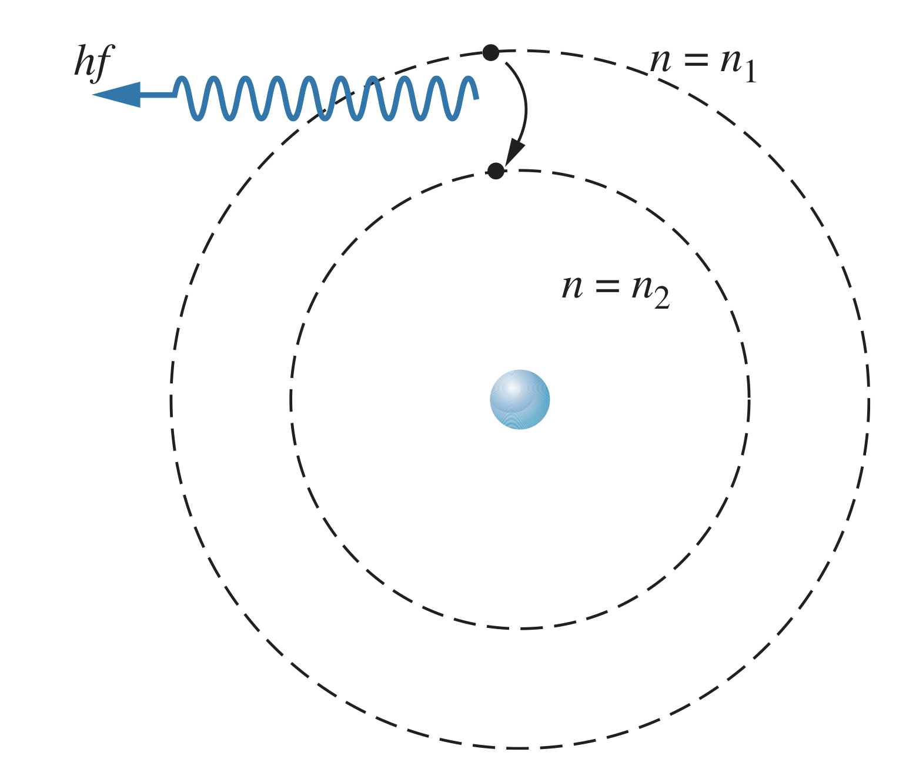

## Building on Rutherford's Model

Niels Bohr took Rutherford's idea of a nucleus for the positive charge in atoms, and built on it by theorizing a planetary-like structure of the atom. The electrostatic Coulomb force provides the necessary acceleration to keep the electrons in orbit.

While not correct in its description of the actual structure of atoms, Bohr's model is useful in beginning to understand how atoms work.

### Forces

In a hydrogen atom, there is one electron (with negative electric charge) and a nucleus (with positive electric charge). The attractive force, the electrostatic Coulomb force, provides centripetal acceleration $v^2/r$, meaning

$$F=\frac{1}{4\pi\epsilon_0}\frac{\left|q_1\right|\left|q_2\right|}{r^2}=\frac{1}{4\pi\epsilon_0}\frac{e^2}{r^2}=\frac{mv^2}{r}$$

If you assume the nucleus stays at rest (since it is so much more massive than the electrons), the kinetic energy of the electron is

$$K=\frac{1}{2}mv^2=\frac{1}{8\pi\epsilon_0}\frac{e^2}{r}$$

And using the equation for electric potential energy, the potential energy of the electron-nucleus system is found as follows:

$$U=\frac{1}{4\pi\epsilon_0}\frac{q_1q_2}{r}=-\frac{1}{4\pi\epsilon_0}\frac{e^2}{r}$$

Using the formulas for kinetic and potential energy, the total energy of the system is found as such:

$$E=K+U=\frac{1}{8\pi\epsilon_0}\frac{e^2}{r}+\left(-\frac{1}{4\pi\epsilon_0}\frac{e^2}{r}\right)=-\frac{1}{8\pi\epsilon_0}\frac{e^2}{r}$$

### Stationary states

One of the major problems with the Bohr model is that an electron orbiting as Bohr predicted would radiate electromagnetic radiation as it went around the nucleus, meaning it would be losing energy and would eventually spiral into the nucleus and the atom would collapse.

Bohr predicted there were certain stable orbits in an atom, called **stationary states**, where the electron would not radiate electromagnetic energy.

Stationary states, Bohr predicted, occurred when the angular momentum, $L$, of the electron is integer multiples of $\hslash$, such as $\hslash, 2\hslash, 3\hslash$. This is called the *quantization of angular momentum*.

Since $\boldsymbol{\overrightarrow{L}}=\boldsymbol{\overrightarrow{r}}\times\boldsymbol{\overrightarrow{p}}$, and since the position vector, $\boldsymbol{\overrightarrow{r}}$, is perpendicular to the linear momentum of the electron, $\boldsymbol{\overrightarrow{p}}$, for its orbit, the magnitude of angular momentum is simply $L=rp=mvr$. Therefore, Bohr postulated that

$$mvr=n\hslash$$

where $n$ is an integer. Using the formula for kinetic energy,

$$\frac{1}{2}mv^2=\frac{1}{2}m\left(\frac{n\hslash}{mr}\right)^2=\frac{1}{8\pi\epsilon_0}\frac{e^2}{r}$$

Rearranging, the formula for the allowed values for the radius, $r$, is

$$r_n=\frac{4\pi\epsilon_0\hslash^2}{me^2}n^2=a_0n^2$$

$a_0$ is called the **Bohr radius**, and is defined as

$$a_0=\frac{4\pi\epsilon_0\hslash^2}{me^2}=0.0529nm$$

### Energy levels

Bohr's theory therefore predicts that electrons can only orbit in integer square multiples of a certain base radius, unlike other classical orbiting systems.

Using the formula above for energy, we get

$$E_n=-\frac{me^4}{32\pi^2\epsilon_0^2\hslash^2}\frac{1}{n^2}=\frac{-13.60eV}{n^2}$$

where $n$ is an integer. These so-called **energy levels** are therefore quantized, and only come in certain values. When $n=1$, the energy is $-13.60$eV, and the electron orbits at a radius of $0.0529$nm. This is called the **ground state**. Higher energy states are called the **excited states**.

The amount of energy above the ground state is called the **excitation energy** of the excited state. It can be thought of as the amount of energy required for the electron to "jump" to higher energy states. The magnitude of the electron's energy is called the **binding energy**. If an electron absorbs an amount of energy equal to the binding energy, it will be removed from the atom (using more energy than required will result in the electron having some kinetic energy once it is freed). The amount of energy required to remove an electron from an atom is called the **ionization energy**.

If an electron is added to an atom from a distance, the binding energy is also how much energy will be released (usually in the form of photons). 

## Hydrogen Wavelengths

When an electron transitions from an excited state to a lower-energy state (such as the ground state), the energy difference in the levels will be released as a photon with energy $hf$.

$$hf=E_{n_1}-E_{n_2}$$

Using the formula for the energy,

$$f=\frac{me^4}{64\pi^3\epsilon_0^2\hslash^3}\left(\frac{1}{n_2^2}-\frac{1}{n_1^2}\right)$$

And the wavelength is therefore

$$\lambda=\frac{c}{f}=\frac{64\pi^3\epsilon_0^2\hslash^3c}{me^4}\left(\frac{n_1^2n_2^2}{n_1^2 - n_2^2}\right)=\frac{1}{R_\infty}\left(\frac{n_1^2n_2^2}{n_1^2 - n_2^2}\right)$$

$R_\infty$ is called the *Rydberg constant*, and is equal to

$$R_\infty=\frac{me^4}{64\pi^3\epsilon_0^2\hslash^3c}=1.097373*10^7~m^{-1}$$

This formula matches remarkably close to the Balmer series.

### Bohr model and the Ritz combination principle

Bohr's formulas can also explain the Ritz combination principle:

$$f_{n_3\rightarrow n_2}=cR_\infty \left(\frac{1}{n_3^2}-\frac{1}{n_2^2}\right)\newline f_{n_2\rightarrow n_1}=cR_\infty \left(\frac{1}{n_2^2}-\frac{1}{n_1^2}\right)$$

Combining these two equations gives

$$f_{n_3\rightarrow n_2}+f_{n_2\rightarrow n_1}=cR_\infty \left(\frac{1}{n_3^2}-\frac{1}{n_2^2}\right)+cR_\infty \left(\frac{1}{n_2^2}-\frac{1}{n_1^2}\right)=cR_\infty \left(\frac{1}{n_3^2}-\frac{1}{n_1^2}\right)=f_{n_3\rightarrow n_1}$$

Since this also works with energies, the amount of energy emitted by "skipping" energy levels is the same as would be emitted if the electron went down each energy level individually. And since atoms are typically found in their ground states, that is why absorption spectra are not the same as emission spectra: the absorption spectrum only shows transitions from the ground state.

## Atoms with $Z\gt 1$

The above equations are only for atoms with a nucleus of charge $+1$ (hydrogen). For atoms with nuclei whose charge is $Ze$,

$$F=\frac{1}{4\pi\epsilon_0}\frac{\left|q_1\right|\left|q_2\right|}{r^2}=\frac{1}{4\pi\epsilon_0}\frac{Ze^2}{r^2}$$

Therefore, the allowed radii are:

$$r_n=\frac{4\pi\epsilon_0\hslash^2}{Ze^2m}n^2=\frac{a_0n^2}{Z}$$

And energies become

$$E_n=-\frac{m\left(Ze^2\right)^2}{32\pi^2\epsilon_0^2\hslash^2}\frac{1}{n^2}=-\left(13.60eV\right)\frac{Z^2}{n^2}$$

This means for atoms with higher nuclear charge, electrons are more tightly bound to the nucleus and orbit the nucleus closer.