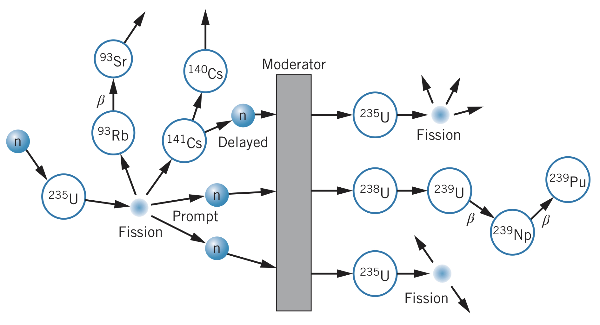

Massive nuclei can be produced in accelerators by colliding projectiles and targets. Isotopes of massive elements tend to be radioactive, however they do not decay using alpha or beta processes. Instead, their nuclei split into smaller pieces of much smaller masses (as well as a few neutrons). This is called **nuclear fission**. For example:

$$^{254}_{98}\text{Cf}_{156}\rightarrow~^{140}_{54}\text{Xe}_{86}+^{110}_{44}\text{Ru}_{66}+4\text{n}$$

Fission is spontaneous for a few nuclei but can be induced for other nuclei by adding energy.

Nuclei are typically regarded as sphere of neutrons and protons experiencing a mutual attraction around their center. However, if nuclei become distorted, they can vibrate around their equilibrium shape like a stretched spring.

For some nuclei, their equilibrium shape is already slightly distorted, and so can vibrate to the point where they split into two smaller nuclei after reaching some *fission barrier*. The nucleus does not need to reach the barrier height, as it can tunnel through the energy barrier, but that process is highly unlikely at its thickest point.

Additionally, the same nuclei are not always produced in a fission process. Instead, it is determined using probabilities.

## Energy Released

The change in binding energy between the nucleons in the initial and final nuclei result in some excess amount of energy that must be released. Most of this energy released (about 80 percent) goes to repelling the two similarly-charged nuclei after the reaction. Therefore, the energy goes from nuclear binding energy to the Coulomb potential energy of nuclear fragments to the kinetic energy of those fragments. These nuclear fragments collide with other atoms, perceived as a temperature increase in the material.

The other 20% of the energy goes into decay products (betas and gammas) of the highly radioactive fragments.

## Induced Fission

Fission in other atoms can be induced by adding enough energy to overcome the fission barrier. This can be done using photons but is typically done using neutrons. For instance,

$$^{235}_{92}\text{U}_{143}+\text{n}\rightarrow~^{93}_{37}\text{Rb}+~^{141}_{55}\text{Cs}_{86}+2\text{n}$$

The neutrons resulting from this fission process can be absorbed by other nearby nuclei, inducing another fission process. This chain-reaction process can occur very quickly and uncontrollably (like in a nuclear weapon) or in a controlled manner (like in a nuclear reactor).

## Electrical Power from Fission

Using the thermal energy released in fission to boil water, electrical energy can be generated. However, pure uranium cannot be used for three principle reasons.

### Enrichment

Pure uranium contains about 99.3% of $^{238}\text{U}$, which removes neutrons from the reaction instead of perpetuating the nuclear reaction like $^{235}\text{U}$ does. To fix this problem, natural uranium is *enriched* so that it includes more than 0.3% of $^{238}\text{U}$ (usually about 3–5%), allowing the fission process to occur. However, this is difficult since the two isotopes are chemically identical, meaning uranium needs to be enriched using the small mass difference between the isotopes.

### Moderation

Since the fission cross section decreases with increasing neutron energy (and since the resulting neutrons typically have energies in the $\text{MeV}$ range), the neutrons must be slowed down, or *moderated*, to increase the probabilities of fission reactions occurring. The material is surrounded by a *moderator*, where the neutrons lose energy in collisions with atoms (hydrogen is typically used due to the light mass of hydrogen atoms). Water is another good choice, but the neutrons can be absorbed by the water. Therefore, "heavy water," when the hydrogen is replaced with deuterium, is a better choice to increase the number of available neutrons.

### Control

For a stable nuclear reactor, the average number of neutrons in each fission reaction available to produce the next set of reactions must be exactly equal to 1. If it is even slightly greater than one, the reaction rate will grow exponentially out of control.

In a nuclear reactor, *control rods* are inserted into the core, which have a large cross section for absorbing neutrons, removing excess neutrons from the reaction. Some neutrons (about 1%) are produced in the seconds following a fission process due to the radioactive decay of the resulting products.

## Fission Reactors

In the core of a nuclear reactor, heat is produced that needs to be extracted to generate electrical energy. If this system fails, however, enough heat will still be generated to melt the reactor core, resulting in a serious accident. Therefore, systems are in place to cool the core if the system fails.

In a pressurized water reactor, heat is extracted by circulating through the core under great pressure (to prevent it from becoming steam). The hot water then heats a second water system, where water is boiled, where the steam is used to spin a turbine. The steam never goes near the reactor core so it does not become radioactive.

Other reactors use different liquid metals instead of pressurized water, or even gas flow systems.

### Problems with nuclear power generation

The waste produced by nuclear reactors is radioactive and has a long half-life. It must be stored in a safe manner to prevent biological and environmental disasters. Many people are concerned about this problem (and nuclear reactors as a whole), but also the problems of reactors themselves being designed in ways to prevent issues with natural disasters or terrorism.

### A naturally occurring fission reactor

In Earth's history, there used to be a higher proportion of $^{235}\text{U}$ than there is today (due to its half-life). Therefore, a nuclear reactor existed using a deposit of underground uranium and ground water as a moderator. The water likely acted to slow or even stop the fission process when it boiled, cooling the "core."