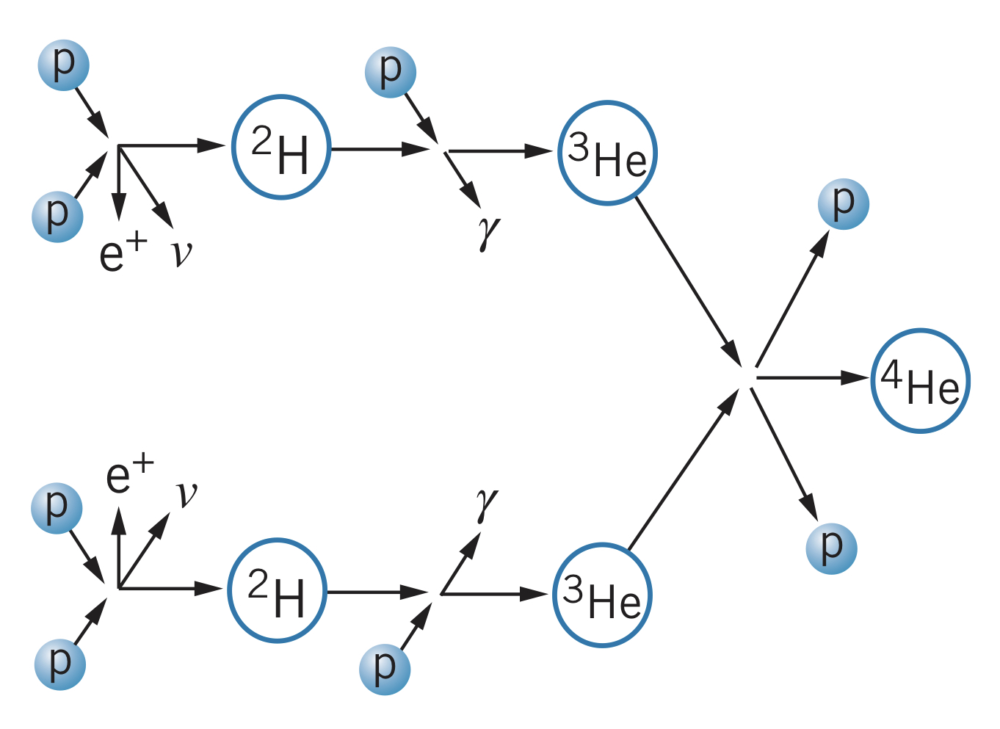
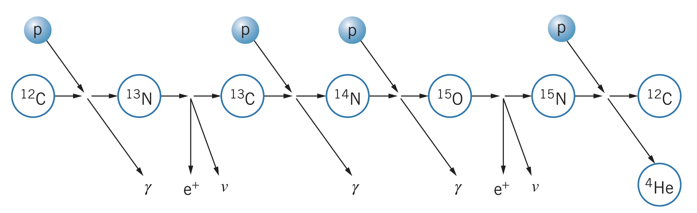
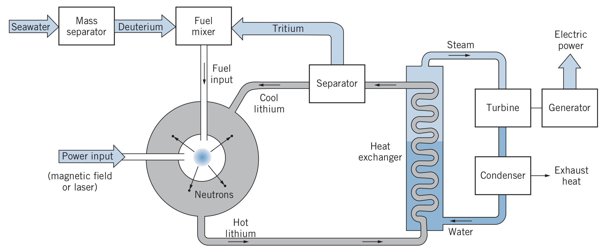

Light nuclei can be combined to form a heaver nucleus in the process of **nuclear fusion**. To create a reaction, nuclei must become close enough that the strong nuclear force can fuse them. In other words, we must overcome the Coulomb repulsive force between the nuclei.

In order to give atoms enough energy to overcome this repulsion, the material can be heated (called *thermonuclear fusion*). The issue with thermonuclear fusion, however, is that it takes an incredibly high temperature ($\sim 10^9~\text{K}$) to energize the nuclei enough. One place where there is this sort of energy, however, is in stars.

## Fusion Process in Stars

In stars, four protons combine to make one $^4\text{He}$. But since stars are composed of regular hydrogen, deuterium needs to be created first:

$$^1_1\text{H}_0+~^1_1\text{H}_0\rightarrow~^1_1\text{H}_1+e^++\nu$$

Note: this is analogous to the beta decay process. Using the $^2\text{H}$, the following reaction occurs:

$$^2_1\text{H}_1+~^1_1\text{H}_0\rightarrow~^3_2\text{He}_1+\gamma$$

then

$$^3_2\text{He}_1+~^3_2\text{He}_1\rightarrow~^4_2\text{He}_2+2~^1_1\text{H}_0$$

Note: the first two reactions occur twice to produce the two $^3\text{He}$, so in total:

$$4~^1_1\text{H}_0\rightarrow~^4_2\text{He}_2+2e^++2\nu+2\gamma$$

To find the $Q$ value of the reaction, it is balanced with four electrons on either side (the left side electrons combine with the protons to form neutral hydrogen atoms, whereas the right side electrons combine with the helium and positrons to produce photons):

$$Q=\left(m_i-m_f\right)c^2=\left[4m\left(~^1\text{H}\right)-m\left(~^4\text{He}\right)\right]c^2=26.7~\text{MeV}$$

This sequence is known as the proton-proton cycle, and is where the Sun gets most of its energy. However, it the first reaction is very unlikely to occur in many stars, which instead use the carbon cycle:

$$^{12}\text{C}+~^1\text{H}\rightarrow~^{13}\text{N}+\gamma\newline~^{13}\text{N}\rightarrow~^{13}\text{C}+e^++\nu\newline~^{13}\text{C}+~^1\text{H}\rightarrow~^{14}\text{N}+\gamma\newline~^{14}\text{N}+~^1\text{H}\rightarrow~^{15}\text{O}+\gamma\newline~^{15}\text{O}\rightarrow~^{15}\text{N}+e^++\nu\newline~^{15}\text{N}+~^1\text{H}\rightarrow~^{12}\text{C}+~^4\text{He}$$

## Fusion Reactors

In a controlled thermonuclear reactor, there is a variety of reactions that can be used. The most common, due to its high energy yield, is D-T or deuterium-tritium, where a deuterium and tritium atom are combined to produce helium and a neutron. In a reactor, the gas is typically heated to the point of ionization, where it turns into a plasma. In order to maximize the probability of collisions, the plasma must have a high density $n$, a high temperature $T$, and a long confinement time $\tau$.

In order for the fusion power to exceed the input power, there must be some minimum value of $n\tau$, which is called *Lawson's criterion*:

$$n\tau\geq~10^{20}~\text{s}\cdot\text{m}^{-3}$$

Because of the electrical repulsion of the ions in the plasma, they often force each other towards the walls of the container, losing energy in collisions with the cooler atoms. To fix this, multiple techniques are under development.

### Magnetic confinement

A magnetic field can be used to confine the plasma since the charged particles spiral around the magnetic field lines. In a toroidal geometry (called a tokamak), helical field lines are created in the confinement, produced by the field coils and electric current passed through the current.

### Inertial confinement

In inertial confinement, the confinement times are shortened but the fuel is compressed to very high densities. In one such system using a laser, a pellet of D-T is struck from many angles, first converting it into a plasma then heating and compressing it to the point that fusion can occur.

## Fusion Reactor Design

Since much of the energy in a fusion reaction is carried by the neutrons (in contrast to in a fission reaction), extracting the energy from a reaction is more difficult. One solution is to surround the reaction area by lithium, capturing neutrons in the reaction

$$^6_3\text{Li}_3+\text{n}\rightarrow~^4_2\text{He}_2+~^3_1\text{H}_2$$

The kinetic energy dissipates as heat, then the thermal energy of the lithium can be used to boil water and generate electrical energy. Note: this reaction also produces tritium, needed for the reaction.

Although fusion reactors do not result in radioactive waste, the excess of neutrons generated makes the surrounding area radioactive, which can weaken parts of the reactor vessel. However, lithium can be used again to stop most of the neutrons from escaping.

