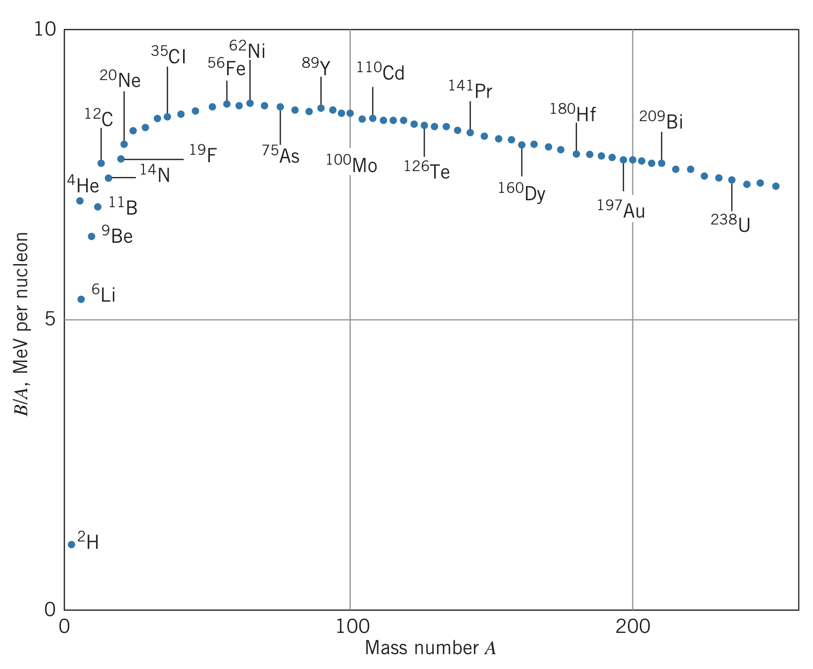

## Building an Atom

Taking the rest energies of a proton and electron far away from another ($m_pc^2+m_ec^2$) minus the $13.6~\text{eV}$ in photons emitted from bringing them together results in the rest energy of the hydrogen atom:

$$m_pc^2+m_ec^2-m\left(\text{H}\right)c^2=13.6~\text{eV}$$

In other words, the rest energy of the combined system (the hydrogen atom) is less than the rest energy of its constituents (an electron and a proton) by $13.6~\text{eV}$. This energy difference is called the **binding energy**.

This extends to isotopes, such as deuterium ($^2_1\text{H}_1$):

$$B=m_nc^2+m_p^2-m_\text{D}c^2$$

where $m_\text{D}$ is the mass of the deuterium nucleus. Using the atomic masses $m\left(^1\text{H}\right)c^2=m_pc^2+m_e^2-13.6~\text{eV}$ and $m\left(^2\text{H}\right)c^2=m_\text{D}c^2+m_e^2-13.6~\text{eV}$, we get

$$B=m_nc^2+\left[m\left(^1\text{H}\right)c^2-m_ec^2+13.6~\text{eV}\right]-\left[m\left(^2\text{H}\right)c^2-m_ec^2+13.6~\text{eV}\right]\newline=\left[m_n+m\left(^1\text{H}\right)-m\left(^2\text{H}\right)\right]c^2$$

Generalizing, we find that for a nucleus $X$ of mass number $A$ with $Z$ protons and $N$ neurons,

$$B=Nm_nc^2+Zm_pc^2-m_Xc^2$$

To expand $m_X$, we would have to consider the energies associated with bringing electrons close to the nucleus. However, these energies are so minuscule compared to the nuclear mass energy that the binding energy can be approximated as

$$B=\left[Nm_n+Zm\left(^1_1\text{H}_0\right)-m\left(^A_ZX_N\right)\right]c^2$$

Comparing $B/A$, we can compare the relative nuclear binding energies per nucleon:

Looking at this diagram, we see that there are two ways to lower the energy of the nucleus: we can split a large nucleus into two, releasing energy (called fission), or we can combine small nuclei to release energy (called fusion).

## Proton and Neutron Separation Energies

Adding the ionization energy $E_\text{i}$ of hydrogen ($13.6~\text{eV}$) to the hydrogen atom results in an $\text{H}^+$ ion and a free electron. Generalizing to an atom $X$, we get

$$X\rightarrow X^++e^-:~~~~E_i=m\left(X^+\right)c^2+m_ec^2-m\left(X\right)c^2=\left[m\left(X^+\right)+m_e-m\left(X\right)\right]c^2$$

A similar process can be done to the nucleus, where the least tightly bound proton or neutron is removed. The energy required is called the *proton separation energy* $S_p$. In a similar way to before, we can say

$$^A_ZX_N\rightarrow ^{A-1}_{Z-1}X'_N+p:~~~~S_p=\left[m\left(^{A-1}_{Z-1}X'_N\right)+m\left(^1\text{H}\right)-m\left(^A_ZX_N\right)\right]c^2$$

Similarly, for the *neutron separation energy* $S_n$,

$$^A_ZX_N\rightarrow ^{A-1}_ZX_{N-1}+n:~~~~S_n=\left[m\left(^{A-1}_ZX_{N-1}\right)+m_n-m\left(^A_ZX_N\right)\right]c^2$$