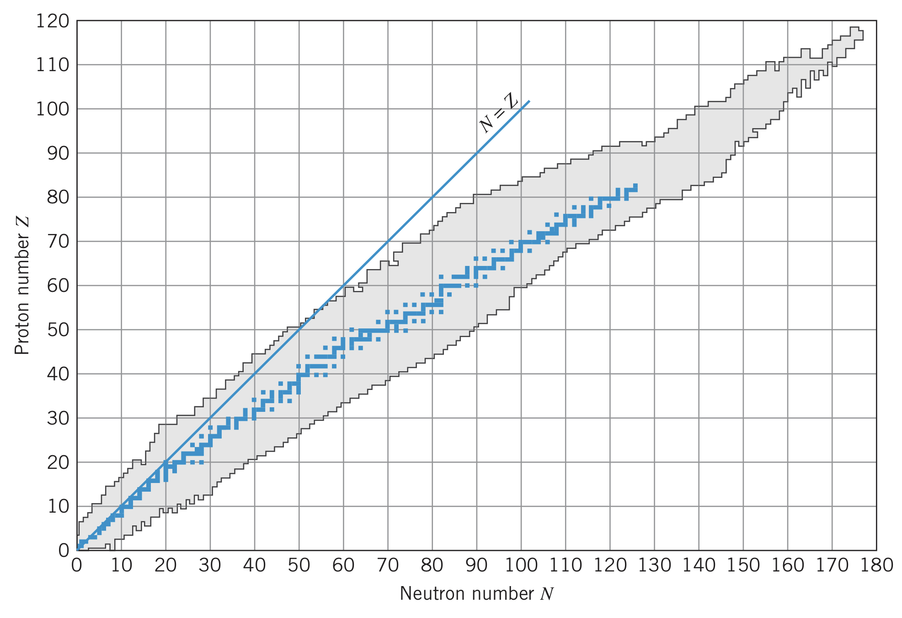

## Stable Nuclei

In small atoms, nuclei with equal numbers of neutrons and protons are quite stable, but as the atomic number increases, more neutrons are required to separate the protons due to the growing Coulomb repulsion factor of $Z\left(Z-1\right)$.

Most of the nuclei in the image above are unstable, meaning they transform themselves into more stable nuclei in one of three processes:

1. Nuclei can emit $^4\text{He}$ to change their $Z$ and $N$ (called *alpha decay*)
2. Nuclei can change a neutron into a proton or proton into a neutron (called *beta decay*)
3. Nuclei in excited states can emit photons to transition to ground states (called *gamma decay*)

These processes are called **radioactive decay**.

## Rate of Radioactive Decay

The rate at which radioactive nuclei decay in a sample is called the **activity** of a sample. The greater the activity, the more nuclear decays per second. Activity is measured in the curie, where

$$1~\text{curie (Ci)}=3.7\times 10^{10}~\text{decays/s}$$

In a radioactive substance, the probability any given nucleus decays is equal to its activity divided by the number of radioactive nuclei. This decay probability is called the **decay constant**, denoted $\lambda$. In other words, an activity $a$ depends on the number of radioactive nuclei $N$ and the decay constant $\lambda$:

$$a=\lambda N$$

But as the substance decays, there are fewer radioactive nuclei. Therefore, we can regard $a$ as the change in the number of radioactive nuclei per unit time:

$$a=-\frac{dN}{dt}$$

Combining this with the expression of activity above, we see

$$\frac{dN}{N}=-\lambda~dt$$

Integrating, we get

$$N=N_0e^{-\lambda t}$$

where $N_0$ is the number of nuclei originally present at $t=0$. This is called the *exponential law of radioactive decay*. Since it can be difficult to measure $N$, we can multiply both sides by $\lambda$ to get

$$a=a_0e^{-\lambda t}$$

where $a_0$ is the original activity.

### Half-life

The **half-life**, $t_{1/2}$, of the decay is the time it takes for the activity to be reduced by half. Therefore, when $t=t_{1/2}$, $a=\frac{1}{2}a_0=a_0e^{-\lambda t_{1/2}}$, so

$$t_{1/2}=\frac{1}{\lambda}\ln{2}=\frac{0.693}{\lambda}$$

The *mean lifetime*, $\tau$, is defined as

$$\tau=\frac{1}{\lambda}$$

where when $t=\tau$, $a=a_0e^{-1}=0.37a_0$.

## Conservation Laws

Certain universal laws (called conservation laws) limit the types of radioactive decay that can happen.

### Conservation of energy

The conservation of energy allows us to determine which types of decay are energetically possible and allows calculations of the rest energies and kinetic energies of decay products.

Say a nucleus $X$ decays into a lighter nucleus $X'$ via the emission of one or particles collectively called $x$. The excess energy, called the $Q$ *value* of the decay $X\rightarrow X'+x$ is

$$Q=\left[m_X-\left(m_{X'}+m_x\right)\right]c^2$$

The decay is only possible if $Q$ is positive. That excess energy appears as kinetic energy of the decay products:

$$Q=K_{X'}+K_x$$

### Conservation of linear momentum

Assuming the initial nucleus is at rest, the final linear momentum of the resulting particles must be zero:

$$\boldsymbol{\overrightarrow{p_{X'}}}+\boldsymbol{\overrightarrow{p_x}}=0$$

Since the particle(s) $x$ are typically much less massive than $X'$, the *recoil momentum* $p_{X'}$ yields a very small kinetic energy $K_{X'}$

### Conservation of angular momentum

The total spin angular momentum of the initial particle before the decay must equal the total angular momentum (spin and orbital) of all the products after the decay process.

### Conservation of electric charge

The total net electric charge before the decay must equal the net electric charge after the decay.

### Conservation of nucleon number

Although particles (like electrons and photons) can be created via the excess energy of the decay process, neutrons and protons cannot be created. Instead, only some processes can convert neutrons to protons and vice versa. That is, the total nucleon number $A$ does not change in decay or reaction processes.