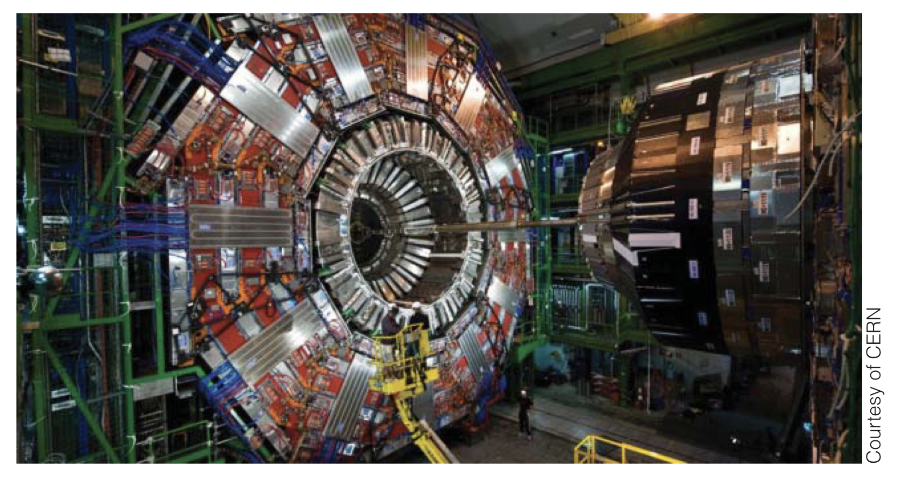
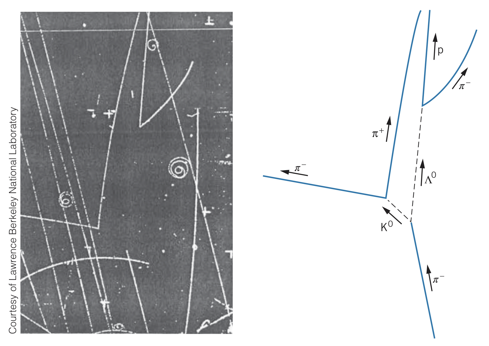

Since most elementary particles do not exist in nature and are highly unstable, they must be created and observed in violent collisions, where a beam of highly energetic particles smashes into a target. Protons are typically used for the beam of particles since they are very stable and can be stored for long periods of time.

In the *Large Hadron Collider*, beams of protons are accelerated to $7~\text{TeV}$ and set on a collision course with each other. As a result of the collision, a wide variety of mesons and baryons are produced. It is the goal of particle physics to study these particles.

Beams of other types of particles (besides protons) can be produced via proton beam interactions. Magnetic and electric fields are used to steer other particles into concentrated beams to be used in other collisions. However, the timescales particles exist for are incredibly small, so even traveling near the speed of light, these collisions must be physically close to one another. Thankfully, special relativity's time dilation extends the apparent lifetimes of particles long beyond their proper lifetimes, allowing collisions to occur.

## Detecting Particles

Particles are very technically challenging to detect since they decay so fast. In order to observe particles created in a collision, the collision must be surrounded by a medium in which particles can stop (to measure their energy) and one with a magnetic field (to measure their momentum). One technique is to use a *bubble chamber*, which is filled with liquid hydrogen. Particles leave lines of bubbles from ionizing the hydrogen atoms, which can be photographed. The curvature of these lines (caused by the magnetic field) can be used to measure the momentum of the particles, and the length of the lines can be used to measure the lifetime of particles. Even non-charged particles' lifetimes can be measured by using the distance between the particle's creation and its decay.

### Resonance particles

However, some particles only exist for $10^{-23}$ seconds. How can these particles possibly be observed, and how can they be known to exist instead of a reaction involving their decay products? It turns out the decay products (for instance, two pions) can combine for an instant ($10^{-23}~\text{s}$) and have all the same properties as a particle. These are called *resonance particles*.

If we observe two particles, one with energy $E_1$ and momentum $\boldsymbol{\overrightarrow{p_1}}$ and another with energy $E_2$ and momentum $\boldsymbol{\overrightarrow{p_2}}$, we can use conservation of energy and linear momentum to determine a particle with energy $E=E_1+E_2$ and momentum $\boldsymbol{\overrightarrow{p}}=\boldsymbol{\overrightarrow{p_1}}+\boldsymbol{\overrightarrow{p_2}}$ would have had to exist for the decay particles to be observed. We can then find its rest energy as $mc^2=\sqrt{E^2-c^2\boldsymbol{\overrightarrow{p}}^2}=\sqrt{\left(E_1+E_2\right)^2-c^2\left(\boldsymbol{\overrightarrow{p_1}}+\boldsymbol{\overrightarrow{p_2}}\right)^2}$.

While the existence of a resonance particle can be incidental, with a statistically significant number of collisions, we can confidently conclude a short-lifetime particle did exist. Using the uncertainty relationship $\Delta E\approxeq\hbar/\Delta t$, we can deduce the lifespan of the particle using the width of the resonant energy peak.