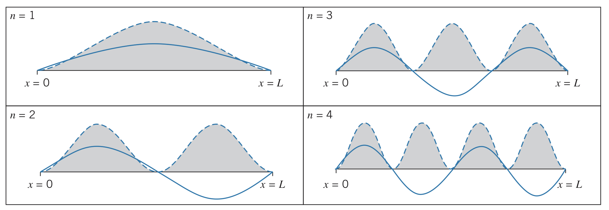
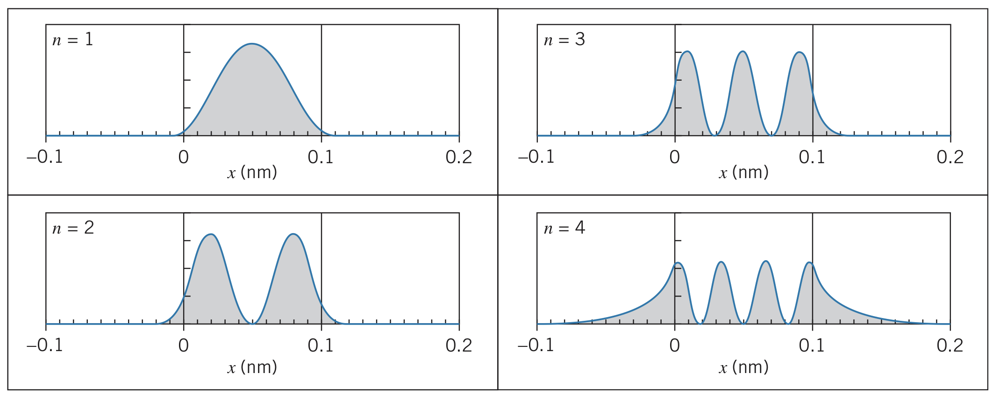
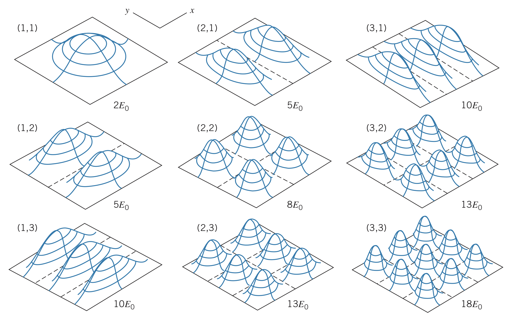
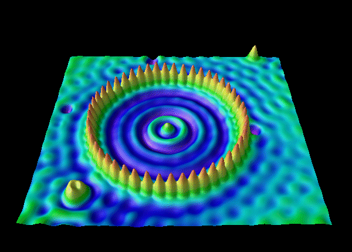

## Constant Potential Energy

If the potential energy is constant, the Schrödinger equation becomes:

$$-\frac{\hbar^2}{2m}\frac{d^2\psi}{dx^2}+U_0\psi\left(x\right)=E\psi\left(x\right)$$

### Assuming $E\gt U_0$

Then using the fact that

$$\frac{d^2\psi}{dx^2}=-k^2\psi\left(x\right)$$

from the equation for the wave function, $\psi$, the wave number, $k$, can be represented as

$$k=\sqrt{\frac{2m\left(E-U_0\right)}{\hbar^2}}$$

The solution to this equation gives a form where the second derivative is equal to itself multiplied by a negative constant, meaning it can be represented in the form

$$\psi\left(x\right)=A\sin{kx}+B\cos{kx}$$

### If $E\lt U_0$ (forbidden region)

Rewriting the solution for the case where $E\lt U_0$, we get

$$\frac{d^2\psi}{dx^2}=k'^2\psi\left(x\right)$$

where

$$k'=\sqrt{\frac{2m\left(U_0-E\right)}{\hbar^2}}$$

In this case, the solution can generally be written as

$$\psi\left(x\right)=Ae^{k'x}+Be^{-k'x}$$

## The Free Particle

For any free particle, the force it experiences is 0. This means the potential energy is constant (we say $U_0=0$), so the energy of the particle is

$$E=\frac{\hbar^2k^2}{2m}$$

using the form $\psi\left(x\right)=A\sin{kx}+B\cos{kx}$. Notice how $k$ can have any value, meaning the energy is *not quantized*.

### Normalization integral

Since this cannot be integrated from $-\infty$ to $+\infty$, we cannot normalize the wave function in this form. Instead, we use the complex exponentials:

$$\psi\left(x\right)=A\left(\frac{e^{ikx}-e^{-ikx}}{2i}\right)+B\left(\frac{e^{ikx}+e^{-ikx}}{2}\right)=A'e^{ikx}+B'e^{-ikx}$$

where

$$A'=A/2i+B/2\newline B'=-A/2i+B/2$$

The interpretation of this solution relies on the time-dependent version of the Schrödinger equation:

$$\Psi\left(x,t\right)=\left(A'e^{ikx}+B'e^{-ikx}\right)e^{-i\omega t}=A'e^{i\left(kx-\omega t\right)}+B'e^{-i\left(kx+\omega t\right)}$$

The first term represents a wave moving to the right with amplitude $A'$, whereas the second term represents a wave moving to the left with amplitude $B'$.

### Beam of particles

To represent a beam of particles moving in the $+x$ direction, set $B'=0$. Then, the probability density function becomes

$$P\left(x\right)=\left|\psi\left(x\right)\right|^2=\left|A'\right|^2e^{ikx}e^{-ikx}=\left|A'\right|^2$$

which makes sense because the particles are equally likely to be found anywhere along the $x$ axis, giving a completely unlocalized wave.

## Infinite Potential Energy Well

### Setup

The particle is trapped in a region of width $L$ between two infinitely high walls of infinite potential energy. It makes perfectly elastic collisions with either side, so its energy is completely confined to the region. It is said that

$$U\left(x\right)=\begin{cases} 0 & 0\leq x\leq L \newline \infty & x\lt 0,x\gt L \end{cases}$$

### Outside the region

To find the solution outside the region, it is quite clear that $\psi$ must be 0 so that $U\psi$ is not infinite (since $U=\infty$). Additionally, if the particle is always contained in the region, the probability of finding it outside the region must be $0$.

$$\psi\left(x\right)=0~~~~~~~~x\lt 0, x\gt L$$

### Inside the region

Knowing $U\left(x\right)=0$ inside the region, the solution becomes

$$\psi\left(x\right)=A\sin{kx}+B\cos{kx}~~~~~~~~0\leq x\leq L$$

where

$$k=\sqrt{\frac{2mE}{\hbar^2}}$$

To ensure the equation for the wave is continuous at the boundaries where $x=0$ and $x=L$, we set the following restrictions:

$$\psi\left(0\right)=A\sin{0}+B\cos{0}=0\newline \psi\left(L\right)=A\sin{kL}+B\cos{kL}=0$$

The first of these equations gives $B=0$, leaving $A\sin{kL}=0$. Either $A=0$ (which would mean the wave is 0 everywhere) or $\sin{kL}=0$, which is only true when

$$kL=n\pi~~~~~~~~n=1,2,3,...$$

Solving for the wavelength, we find that $\lambda=2L/n$.

!!The solution to the Schrödinger equation for a particle trapped in a linear region is a series of standing de Broglie waves!!

And since only certain wavelengths are permitted, we also can see that

$$E_n=\frac{\hbar^2k^2}{2m}=\frac{\hbar^2\pi^2n^2}{2mL^2}=\frac{h^2n^2}{8mL^2}~~~~~~~~n=1,2,3,...$$

!!The energy is quantized as well!!

### Allowed energies

Setting $E_0=h^2/8mL^2$, we find that $E_n=n^2E_0$. Therefore, only square integer multiples of $E_0$ are allowed. $E_0$, when $n=1$, is called the **ground state**, and all other values of $n$ are called the **excited states**.

By absorbing or releasing energy equal to the difference in energy states, the particle can transition between one excited state and another.

### Normalization

The final step in the solution for $\psi\left(x\right)$ is to determine the value of $A$ that normalizes the function:

$$\int_0^LA^2\sin^2{\frac{n\pi x}{L}}~dx=1$$

Solving this makes $A=\sqrt{2/L}$, so

$$\psi_n\left(x\right)=\sqrt{\frac{2}{L}}\sin{\frac{n\pi x}{L}}~~~~~~~~n=1,2,3,...$$

Between two points, the wave function and probability distributions look something like this for the first few values of $n$:

This is very strange behavior since it means a particle can go between two locations in space without going in the spaces in between them.

### Motion of the particle

For this trapped particle, the uncertainty in position would be $\Delta x=L\sqrt{1/12-1/2\pi^2 n^2}$ and the uncertainty in momentum would be $\Delta p=hn/2L$. Therefore, the product of these two uncertainties is

$$\Delta x\Delta p=\frac{hn}{2}\sqrt{\frac{1}{12}-\frac{1}{2\pi^2 n^2}}=\frac{h}{2}\sqrt{\frac{n^2}{12}-\frac{1}{2\pi^2}}$$

This means the product of the uncertainties grows as $n$ increases. The minimum value occurs when $n=1$:

$$\Delta x\Delta p=0.090h=0.57\hbar$$

## Finite Potential Energy Well

A finite potential energy well can be defined as such:

$$U\left(x\right)=\begin{cases} 0 & 0\leq x\leq L \newline U_0 & x\lt 0,x\gt L \end{cases}$$

### Inside the region

Inside the region is the same as it was for an infinite energy potential well:

$$\psi\left(x\right)=A\sin{kx}+B\cos{kx}$$

although the values for $A$ and $B$ are not valid in this calculation.

### For the region $x \lt 0$

In this case, the energy of the particle is less than its potential energy, so we must use the form $\psi\left(x\right)=Ce^{k'x}+De^{-k'x}$. However, since the region includes $x=-\infty$, the second term would become infinite. Therefore, $D=0$ and the equation becomes

$$\psi\left(x\right)=Ce^{k'x}$$

### For the region $x \gt L$

In this region, we must again use the form $\psi\left(x\right)=Fe^{k'x}+Ge^{-k'x}$. However, since this region includes $x=+\infty$, $F=0$. Therefore,

$$\psi\left(x\right)=Ge^{-k'x}$$

### Solving

We now have five unknowns: coefficients $A$, $B$, $C$, $G$, and the energy, $E$. Additionally, we have four equations from the boundary conditions (continuity for $\psi$ and now $d\psi/dx$ at both $x=0$ and $x=L$) and one equation from the normalization condition.

The energy values must be determined numerically given the situation since the resulting equation results in a transcendental equation that cannot be solved algebraically.

These equations can be solved with specific numbers, given a problem. The key quality of any solution however is that at the boundary conditions, the wave function satisfies both the continuity of the function itself and the continuity of the first derivative of the function, such as the examples shown below:

In these graphs, the penetration property is also clearly seen, as the sinusoidal functions transition into exponential ones at the boundaries. Note that for higher energy levels, the wave penetrates further into the forbidden region.

## Two-Dimensional Infinite Potential Energy Well

Extending the Schrödinger equation to two dimensions, we get:

$$-\frac{\hbar^2}{2m}\left(\frac{\partial^2\psi\left(x,y\right)}{\partial x^2}+\frac{\partial^2\psi\left(x,y\right)}{\partial y^2}\right)+U\left(x,y\right)\psi\left(x,y\right)=E\psi\left(x,y\right)$$

And the two-dimensional version of the infinite potential energy well is defined as follows:

$$U\left(x,y\right)=\begin{cases} 0 & 0\leq x\leq L;0\leq y\leq L \newline \infty & \text{otherwise}\end{cases}$$

This represents a particle confined in an $L \times L$ square, where the corners are $\left(0,0\right)$, $\left(0,L\right)$, $\left(L,0\right)$, and $\left(L,L\right)$. Collisions with the lines $x=0$, $x=L$, $y=0$, and $y=L$ are perfectly elastic.

Just like the previous one-dimensional wells, we assume the function is 0 in the forbidden regions. But now, we also assume the wave function is *separable* in the well. That is,

$$\psi\left(x,y\right)=f\left(x\right)g\left(y\right)$$

where

$$f\left(x\right)=A\sin{k_xx}+B\cos{k_xx}\newline g\left(y\right)=C\sin{k_yy}+D\cos{k_yy}$$

Applying the boundary conditions, we see that

$$\psi\left(0,y\right)=0~~~~\text{and}~~~~\psi\left(L,y\right)=0~~~~\text{for all}~y\newline \psi\left(x,0\right)=0~~~~\text{and}~~~~\psi\left(x,L\right)=0~~~~\text{for all}~x$$

Using these conditions, we see that $B=D=0$, just like the one-dimensional case. We also see that since $\sin{k_xL}=0$ and $\sin{k_yL}=0$, $k_xL$ and $k_yL$ must be integer multiples of $\pi$ (but not necessarily the same multiple).

Putting it all together, we see that

$$\psi\left(x,y\right)=A'\sin{\frac{n_x\pi x}{L}}\sin{\frac{n_y\pi y}{L}}$$

We can find coefficient $A'$ using the normalization of the function:

$$\int\int\psi^2~dx~dy=1$$

Or for this situation,

$$\int_0^Ldy\int_0^LA'^2\sin^2{\frac{n_x\pi x}{L}}\sin^2{\frac{n_y\pi y}{L}}dx=1$$

Solving this equation gives us that

$$A'=\frac{2}{L}$$

### Energy

Plugging this solution into the energy equation, we find that the allowed energies for values of $n_x$ and $n_y$ are

$$E=\frac{\hbar^2\pi^2}{2mL^2}\left(n_x^2+n_y^2\right)=\frac{h^2}{8mL^2}\left(n_x^2+n_y^2\right)$$

The ground state for this situation occurs when $n_x=n_y=1$:

$$E_0=\frac{\hbar^2\pi^2}{2mL^2}=\frac{h^2}{8mL^2}$$

Therefore,

$$E=E_0\left(n_x^2+n_y^2\right)$$

$n_x$ and $n_y$ are called **quantum numbers**, and different combinations of each of them produce different probability density distributions. Just like the one dimensional case, where the value of $\psi^2$ is highest, we expect to find the particle and where it is 0, we do not expect to find the particle. See the examples below:

### Experimental accuracy

This exact probability distribution can be observed using an electron microscope. Below is a picture of a ring of iron atoms, whose probabilities are shown as peaks:

### Degeneracy

It is possible for multiple pairs of quantum numbers to result in the same energy level. This situation is known as **degeneracy** and the energy levels are called **degenerate**.

For example, the energy state $E=13E_0$ can be obtained with $n_x=3$ and $n_y=2$ or $n_x=2$ and $n_y=3$. This is not as dramatic as, say, $E=50E_0$ being obtained by $n_x=1$ and $n_y=7$ versus $n_x=5$ and $n_y=5$. $13E_0$ is said to have *two-fold degeneracy*, whereas $50E_0$ has *three-fold degeneracy* (it can also be represented by $n_x=7$ and $n_y=1$).