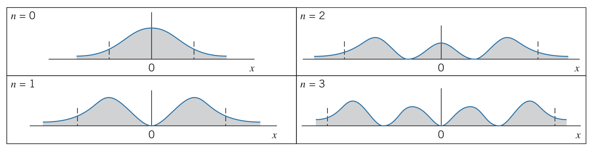

## What is an oscillator?

A classical oscillator is an object of mass $m$ attached to a spring of force constant $k$. The spring exerts a restoring force $F=-kx$ on the object, where $x$ is the displacement from the equilibrium position.

Harmonic oscillators have an angular frequency $\omega_0=\sqrt{k/m}$ and period $T=2\pi\sqrt{m/k}$. Their amplitude is found by their maximum displacement, $x_0$, and their maximum kinetic energies occur at the *turning points* $x=\pm x_0$. Therefore, the motion is confined to $-x_0\lt x\lt +x_0$.

## The Quantum Mechanical Version of a Harmonic Oscillator

Although no natural example of a one-dimensional quantum oscillator exist, there are plenty of systems that behave approximately like oscillators. For instance, a vibrating diatomic molecule.

A force $F=-kx$ has potential energy $U=\frac{1}{2}kx^2$, meaning

$$-\frac{\hbar^2}{2m}\frac{d^2\psi}{dx^2}+\frac{1}{2}kx^2\psi=E\psi$$

There are no boundaries in this situation, but we know that as $x\rightarrow +\infty$ and $x\rightarrow -\infty$, $\psi\rightarrow 0$. The simplest function that satisfies this condition is $\psi\left(x\right)=Ae^{-ax^2}$, where the constant $a$ and energy $E$ can be found by finding the first and second derivatives of the wave function:

$$\frac{d\psi}{dx}=-2ax\left(Ae^{-ax^2}\right)\newline \frac{d^2\psi}{dx^2}=-2a\left(Ae^{-ax^2}\right)-2ax\left(-2ax\right)Ae^{-ax^2}=\left(-2a+4a^2x^2\right)Ae^{-ax^2}$$

Plugging this into the Schrödinger equation from above,

$$\frac{\hbar^2a}{m}-\frac{2a^2\hbar^2}{m}x^2+\frac{1}{2}kx^2=E$$

Instead of solving for $x$, we are trying to make this true for all values of $x$ by finding constants that make that true. For this to be true,

$$-\frac{2a^2\hbar^2}{m}+\frac{1}{2}k=0\newline \frac{\hbar^2a}{m}=E$$

Which results in

$$a=\frac{\sqrt{km}}{2\hbar}\newline E=\frac{1}{2}\hbar\sqrt{k/m}$$

Using the equation for the angular frequency of a classical harmonic oscillator, $E=\frac{1}{2}\hbar\omega_0$.

The coefficient $A$ can be found using the normalization condition, and the result for the ground state wave function is $A=\left(m\omega_0/\hbar\pi\right)^{1/4}$. Therefore, the complete wave function is

$$\psi\left(x\right)=\left(\frac{m\omega_0}{\hbar\pi}\right)^{1/4}e^{-\left(\sqrt{km}/2\hbar\right)}x^2$$

Note that the wave function penetrates into the forbidden region (beyond $x=\pm x_0$), whereas the classical oscillator does not.

### Energies

The solution above only works for the ground-state. The more general solution is $\psi_n\left(x\right)=Af_n\left(x\right)e^{-ax^2}$, where $f_n\left(x\right)$ is a polynomial in which the highest power of $x$ is $x_n$. The energies are

$$E_n=\left(n+\frac{1}{2}\right)\hbar\omega_0~~~~~~~~n=0,1,2,...$$

### Probability distributions

Below are a few examples of what probability densities look like for harmonic oscillators:

### Uncertainties

The resulting uncertainties for this situation are as follows:

$$\Delta x=\sqrt{\hbar/2m\omega_0}\newline\Delta p=\sqrt{\hbar\omega_0m/2}$$

And the product of the uncertainties is $\Delta x\Delta p=\hbar/2$, meaning the uncertainty is at a minimum (called "compact").