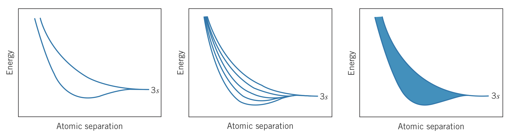
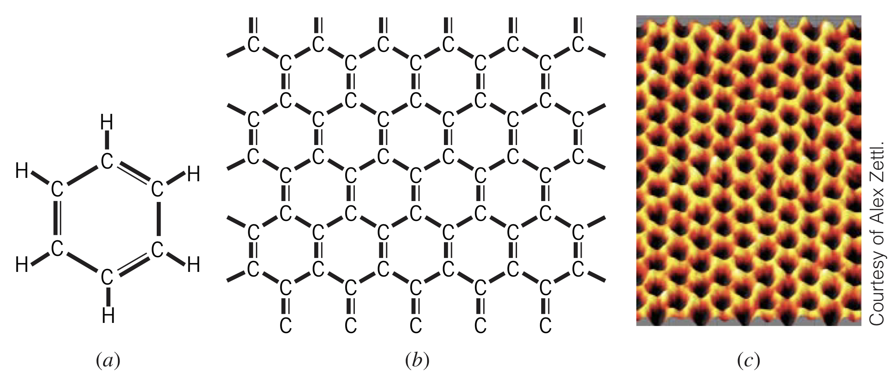

## Overlapping Wave Functions

The typical way of thinking about metals is a sea or gas of free electrons. However, it becomes necessary to consider the interactions between these electrons and the metal ions.

From far away, two atoms' electrons do not interact and thus do not affect each other substantially. Bringing atoms closer to each other, their electrons' wave functions overlap by either adding or subtracting, producing different energies. Adding even more atoms, more wave functions overlap which separates the energy level into even more energies. Eventually with enough atoms nearby (such as $10^{22}$), the energy levels become impossible to distinguish between, forming a "band" of energy levels. For the $3s$ atomic level, this is referred to as the $3s$ band.

### Electron capacity

Since each band has $N$ individual levels (due to $N$ individual atoms), and each level can hold $2\left(2l+1\right)$ electrons, the total capacity for each band is $2\left(2l+1\right)N$ electrons.

Much like atoms themselves, electrons in metals fill the lowest energy bands first, meaning for a metal like sodium, the $1s$, $2s$, and $2p$ bands will be full and the $3s$ band will be half full. Adding energy to the system can excite some electrons to higher energy bands.

### Conductivity

Sodium is a good electrical conductor since it has $N$ free electrons in the $3s$ band, meaning it can easily absorb energy (since there are $N$ unoccupied states within the band). This is due to the *Fermi energy* of sodium being in the middle of the band—a typical property of good electrical conductors.

### Insulators and semiconductors

If the Fermi energy lands in the gap between two energy bands, the electrical conductivity of the substance depends on the energy gap between the valence band (below the Fermi energy) and the conduction band (above the Fermi energy). A wide gap results in no electrons in the conduction band, meaning the substance is a good insulator.

A smaller gap results in some electrons in the conduction band, resulting in a semiconductor. It is possible to add impurities to increase or decrease the Fermi energy. This results in better or worse conductivity and is referred to as *doping*.

### Magnesium

Atomic theory alone would predict that magnesium (with a full $3s$ shell) would be a poor electrical conductor. However, using band theory we see that the $3s$ and $3p$ bands overlap, producing a lot of energy levels for the $2N$ electrons to use, making magnesium a very good conductor.

### Carbon

Carbon, with $2N$ electrons in the $2p$ shell would classically be understood as a good electrical conductor. However, using band theory, its $2s$ and $2p$ bands overlap, meaning carbon has $4N$ electrons in these bands. The interesting thing, however, is that the $2s$ and $2p$ bands separate for carbon, resulting in two $4N$ capacity bands. This results in carbon filling the lower band and not having enough energy to make it to the upper band. This makes carbon a very poor electrical conductor.

## Graphene and Semimetals

Besides metals, semiconductors, and insulators, there are also *semimetals*. Examples include arsenic, antimony, bismuth, and carbon in the form of *graphene*.

Graphene is a single layer of carbon atoms in a hexagonal structure. Essentially a 2-dimensional sheet of carbon, this material was initially very difficult to isolate from graphite, which is many of these layers stacked together.

Graphene is constructed using $sp^2$ hybridization of carbon atoms. The resulting three $\sigma$ bonds join the carbon with three of its neighbors, and the remaining $\pi$ bond is used for electrical conduction.

### Properties of graphene

Graphene as a material is incredibly strong (more so than steel). It is also transparent, flexible, and can carry current densities 100 times that of copper.

Weirdly, the conduction electrons in graphene behave as massless particles (like photons), meaning relativistic equations must be used to analyze their behavior.