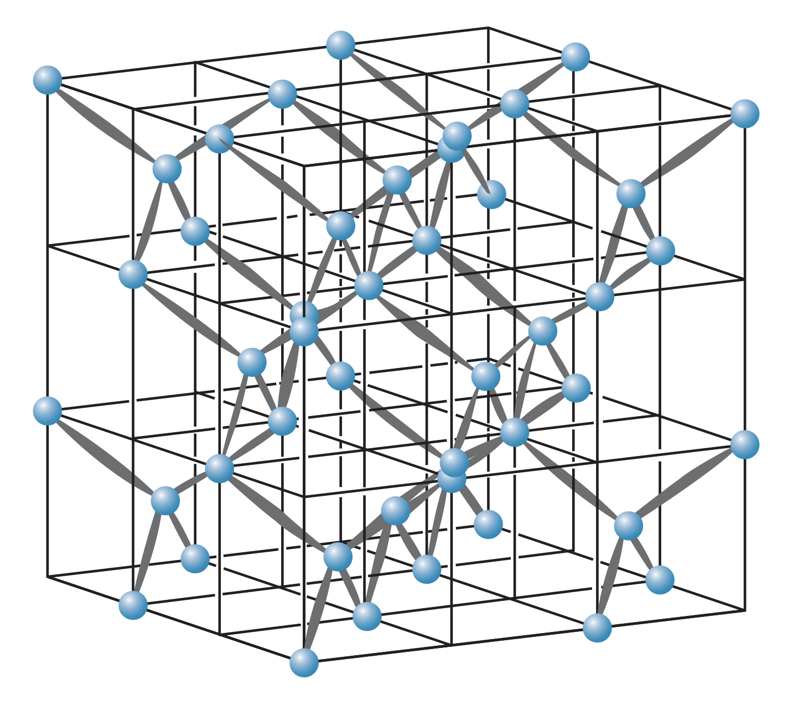

## What are Crystals?

Atoms or molecules can form solids by creating regular structures, called a **lattice**. These materials are called **crystals**. Crystalline materials include many different types of solids, but are distinguished by their *long-range order*, which is how the placement of atoms or molecules is determined by the original arrangement of a few atoms.

Much like a brick wall, once a few are placed, the positions of atoms quite far away are determined automatically. This is notably different than **amorphous** solids, where the structure is not constructed in that way (instead like a pile of bricks).

## Ionic Solids

Ionic materials can form solids since the closed-shell ions (such as $\text{Na}^+$ or $\text{Cl}^-$) can attract many other ions at the same time. This is specific to ionic compounds since covalent bonds rely on specific electrons and wave functions overlapping.

### Cubic lattice

Due to the packing properties of ions, ionic solids form crystalline structures. The simplest of which is the cubic lattice, where atoms are placed on the vertices of a cube.

This arrangement is not very efficient due to the large holes that are the faces or the center of the cube.

### Face-centered cube (fcc) lattice

The face-centered cube (fcc) lattice is a cube lattice with ions placed in the center of each face. This produces a more stable structure due to the higher packing efficiency.

A common fcc material is $\text{NaCl}$, and the fcc lattice is often referred to as the $\text{NaCl}$ structure.

In an fcc lattice, each ion is attracted by six close neighbors, meaning ions do not "belong" to any other given ion.

### Body-centered cube (bcc) lattice

The body-centered cube (bcc) lattice is a cube lattice with an ion placed at the center of the cube shape. 

A common bcc material is $\text{CsCl}$, and the bcc lattice is often referred to as the $\text{CsCl}$ structure.

In a bcc lattice, ions are surrounded by eight other ions.

### Energies

In a $\text{NaCl}$ crystal, each $\text{Na}^+$ ion is surrounded by six $\text{Cl}^-$ ions at a distance $R$, producing a Coulomb attractive force. But they also experience a repulsive force from the eight $\text{Na}^+$ ions at a distance $R\sqrt{2}$, and so on.

This gives a total potential energy, $U_C$ defined as follows:

$$U_C=\sum\frac{q_1q_2}{4\pi\epsilon_0r}=\frac{e^2}{4\pi\epsilon_0}\left(-6\frac{1}{R}+12\frac{1}{R\sqrt{2}}-8\frac{1}{R\sqrt{3}}+...\right)\newline=-\frac{e^2}{4\pi\epsilon_0}\frac{1}{R}\left(6-\frac{12}{\sqrt{2}}+\frac{8}{\sqrt{3}}-...\right)=-\alpha\frac{e^2}{4\pi\epsilon_0}\frac{1}{R}$$

where $\alpha$ is the *Madelung constant*, defined as

$$\alpha=6-\frac{12}{\sqrt{2}}+\frac{8}{\sqrt{3}}$$

However, the value of the constant depends on the geometry of the lattice.

$$\alpha=1.7476~~~~~\text{(fcc or NaCl lattice)}\newline \alpha=1.7627~~~~~\text{(bcc or CsCl lattice)}$$

This attractive force is countered by the repulsive force due to the Pauli exclusion principle, which can be approximated as

$$U_R=AR^{-n}$$

where $A$ is the strength of the potential energy and $n$ is how rapidly it increases at small $R$.

Therefore the total potential energy is

$$U=U_C+U_R=-\alpha\frac{e^2}{4\pi\epsilon_0}\frac{1}{R}+\frac{A}{R^n}$$

To find the equilibrium separation, $R_0$, and binding energy, set $dU/dR$ to zero. This gives

$$A=\frac{\alpha e^2R_0^{n-1}}{4\pi\epsilon_0n}$$

The binding energy is the depth of the energy well near $R=R_0$, so

$$B=-U\left(R_0\right)=\frac{\alpha e^2}{4\pi\epsilon_0R_0}\left(1-\frac{1}{n}\right)$$

The value of $n$ for different crystals can be measured by measuring the *cohesive energy* of the crystal, defined as the energy necessary to dismantle the solid into individual ions.

To calculate the cohesive energy, find the total binding energy $2N_A$ times (since there are two moles of ions per mole of solid). There is also a factor of $1/2$ since each interaction should only be counted once.

$$E_{\text{coh}}=\frac{1}{2}\left(B\right)\left(2N_A\right)=BN_A$$

### Properties

Ionic solids are hard and have high melting and vaporization points. They are also soluble in polar liquids (such as water) since the dipole moment of the polar molecule can break the electrostatic attraction of the ions.

These solids are also poor electrical conductors since they have no free electrons, and are transparent to visible light since they do not have molecular states visible light can excite electrons to. However, they are visible under infrared light due to the vibrational states of the atoms.

## Covalent Solids

Carbon atoms form covalent bonds with each other through $sp^3$ hybridization. These bonds are *directional*, and four of these  can form a solid where a central carbon atom is equally bonded to four surrounding carbon atoms. Since these bonds are exactly the same, they form $109.5\degree$ angles with each other in a tetrahedral shape.

Diamonds, a form of crystalline carbon, features only these tetrahedral bonds:

Unlike ionic solids, covalent solids vary widely in their properties and so cannot be generalized in the same way. For instance, diamonds are extremely hard and transparent due to their long bonds. However, other covalent solids like tin have similar structures but are metallic and highly reflective.

Solids with large bond energies like diamonds are hard, have high melting points, are poor electrical and thermal conductors, and are transparent. Solids with small bond energies can have very different properties.

## Metallic Bonds

Metals tend not to form covalent bonds since their valence electrons are rather loosely bound to the atoms. Instead, the structure of metals is a sea (or gas) of free electrons surrounding a lattice of positive ions. This structure maintains its structure due to the attraction between the metal ions and the electron gas.

These crystals often take the form of fcc, bcc, or hcp.

### Hexagon close-packed (hcp) structure

Atoms in a hcp structure form lattices of hexagons. These crystals are quite efficient at packing atoms but have lower bond energies than ionic or covalent bonds. This is the reason metals have lower melting points. And since the electrons can freely interact with photons, metals are not transparent.

Since metallic bonds do not depend on specific sharing or exchanging of electrons, metallic bonds can be formed with various metals by mixing together various proportions of metals.

## Molecular solids

Molecules can also form solids with each other. However, the electrons are already shared within the molecules through molecular bonds. Additionally, molecules are electrically neutral so there cannot be any Coulomb attractive forces between the molecules. Instead, the *electric dipole moments* of the molecules can interact with one another, forming solids.

These dipole cohesive forces (proportional to $1/R^3$ in molecular solids) are weaker than the forces in other solids, so molecular solids typically have lower melting points.

### Polar molecules

Some molecules have permanent electric dipole moments. These molecules are said to be **polar**, and exhibit a positive charge on one end of the molecule and a negative charge on the other end. An example is water.

When bonds form with polar molecules involving hydrogen, they are known as **hydrogen bonds**.

### Non-polar molecule bonding

Even molecules with no permanent dipole moments can have dipole forces. Quantum mechanical fluctuations (which average to zero) can produce instantaneous electric dipole moments in certain atoms, causing a dipole moment by polarizing a nearby atom. This results in an attractive dipole-dipole force called a *van der Waals force*. This is the cause of bonding in certain solids but also physical effects such as surface tension and friction.

Van der Waals forces are extremely weak, so solids bound with these forces have very low melting points.