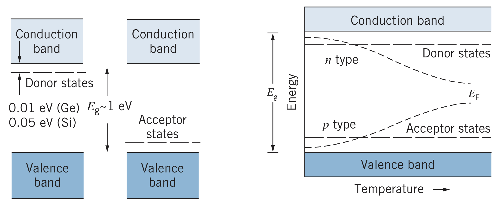

## Intrinsic Semiconductors

In a semiconductor, the Fermi-Dirac distribution function at the bottom of the conduction band is not exactly zero. At room temperature, the occupation probability near the bottom of the conduction band is about $10^{-9}$. This means one atom in $10^9$ participates in electrical conductivity. This is different than an insulator, where about one in every $10^{-44}$ electrons participate.

For a sample with $10^{20}$ atoms, for instance, this means $10^{11}$ electrons in a semiconductor contribute to conduction, compared to $10^{20}$ in a conductor or $0$ in an insulator.

The small presence of electrons in the conduction band is more easily viewed as a few missing electrons in the valence band (again about $10^{-9}$).

### Conduction

When an electric field is applied to the material, the electrons in the conduction band can move easily whereas electrons in the valence band can only move if there is a nearby vacancy for it to move into. That electron moving creates another vacancy, where another electron can move into.

These vacancies in the valence band are called *holes*, and behave as though they have positive charge. With an external electric field, electrons in the conduction layer acquire a drift velocity in the direction opposite the field, whereas the holes acquire a velocity int he same direction as the field. Both these effects result in equal currents.

### Properties of an intrinsic semiconductor

Intrinsic semiconductors have an equal number of electrons in the conduction layer as holes in the valence layer. Their Fermi energy lies in the middle of the gap, their electrons contribute most to the current (but the holes are still important), and about one electron in $10^9$ contributes to the conductivity.

## Impurity Semiconductors

If impurities are deliberately added to alter the conductivity of the material, the semiconductor is known as an impurity semiconductor. The process of introducing impurities is called *doping*.

Consider a lattice of silicon atoms. Each one participates in four bonds with its neighbors, sharing one electron in each bond. This results in no electrons for conductivity since all are used for bonding. Instead if an impurity such as phosphorus was added, there would be an extra electron to participate in conductivity. Alternatively, an impurity of boron (or something with three valence electrons) could be added, essentially creating an electron hole, contributing to the conductivity.

Energy levels formed by impurities with extra electrons are called *donor states* (since those impurities are called *donors*). A semiconductor with donor impurities is called an *n-type* semiconductor since the conductivity is caused by negative electrons.

Energy levels formed by impurities which create holes are called *acceptor states* (since those impurities are called *acceptors*). A semiconductor with acceptor impurities is called a *p-state* semiconductor since the conductivity is caused by positive holes.

